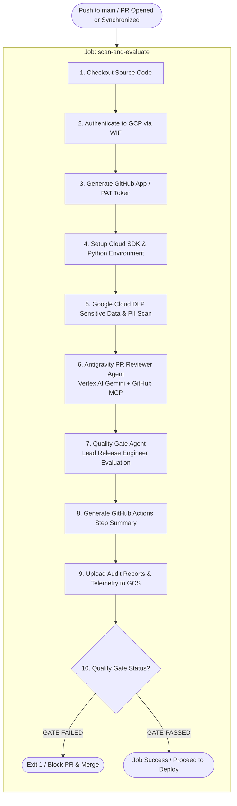
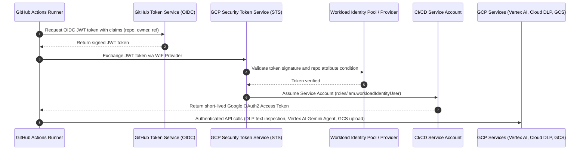

# Security-First Agentic CI/CD with Google Antigravity, Cloud DLP & Workload Identity Federation

## 1. Overview

This directory houses the autonomous **Agentic CI/CD Pipeline** for the repository. It integrates the **Google Antigravity Python SDK**, **Vertex AI (Gemini 3.7)**, **Google Cloud DLP (Data Loss Prevention)**, and **Keyless Workload Identity Federation (WIF)** to automate code review, enforce security & compliance policies, and gate production deployments.

Every pull request and push to `main` undergoes automated vulnerability inspection, PII/secret scanning, architectural review, and release gate decision-making before code can be merged or deployed.

---

## 2. End-to-End Pipeline Architecture



---

## 3. Keyless Authentication via Workload Identity Federation (WIF)

The pipeline eliminates long-lived Service Account JSON keys by exchanging short-lived GitHub OIDC tokens for Google Cloud credentials via **Workload Identity Federation**:



---

## 4. Pipeline Stages & Business Logic

### Stage 1: Cloud DLP Sensitive Data & PII Scan
* **Command:** `gcloud alpha dlp text inspect`
* **Target InfoTypes:** `EMAIL_ADDRESS`, `PHONE_NUMBER`, `LOCATION`, `CREDIT_CARD_NUMBER`, `AUTH_TOKEN`, `API_KEY`.
* **Scope:** Scans all source, configuration, and documentation files (`.tf`, `.yml`, `.yaml`, `.py`, `.sh`, `.json`, `.toml`, `.html`, `.sql`, `.md`) under 500 KB while ignoring binary assets, lockfiles, and virtual environments.
* **Outputs:** 
  * `reports/pii-scan.txt` (Human-readable finding logs)
  * `reports/pii-scan.json` (Structured JSON findings array)

### Stage 2: Antigravity PR Reviewer Agent ([`pr_reviewer_agent.py`](scripts/pr_reviewer_agent.py))
* **Model & Engine:** `google.antigravity.Agent` configured via `LLM_Model` environment variable (defaults to `gemini-3.7-flash`) on Vertex AI.
* **GitHub Integration:** Connected via GitHub MCP (`ghcr.io/github/github-mcp-server:v0.27.0`) for inspecting PR diffs, metadata, and files.
* **Review Checklist & Guardrails:**
  1. **Logic & Correctness:** Boundary conditions, off-by-one errors, and control flow.
  2. **REST API Design & CRUD Best Practices:** Resource-oriented URIs (plural nouns, versioning), semantic HTTP verbs (`GET` idempotent reads, `POST` creation returning `201`, `PUT` replacement, `PATCH` partial updates, `DELETE` returning `204`), accurate HTTP status codes, collection pagination (`limit`/`offset`/`cursor`), and standardized error envelopes (RFC 7807).
  3. **Runtime Performance & Big O Complexity:** Algorithmic bottlenecks, $O(N^2)$ inner loops, linear lookups where sets/dicts provide $O(1)$, repetitive regex compilations, and N+1 query problems.
  4. **Memory Management & Scalability:** Unbounded caches, missing TTL/maxsize, streaming vs full memory buffering on large payloads.
  5. **Loop & Recursion Safety:** Guaranteed loop termination, recursion base cases, and stack overflow prevention.
  6. **Design Patterns & Architecture (SOLID):** Design patterns (Strategy, Factory, Repository, Dependency Injection), loose coupling, and SOLID compliance.
  7. **Cloud DLP Correlation:** Cross-references Cloud DLP findings and flags secrets/PII leaks as `BLOCKER` with `pii_leak: true`.
  8. **Type Safety & Error Resilience:** Null pointer safety, resource leak cleanup (`with` context managers), and retry timeouts.
* **Output & Actions:**
  * Submits inline review comments on modified diff lines.
  * Formats top-level PR review summary.
  * For clean PRs with zero defects, posts an approving review appending a personalized summary highlighting implementation strengths.
  * Writes `reports/pr-review.json` and `reports/pr-review.txt`.

### Stage 3: Quality Gate Decision Agent ([`quality_gate_agent.py`](scripts/quality_gate_agent.py))
* **Role:** Lead Release Engineer & Security Gatekeeper.
* **Input Sources:** `reports/pii-scan.txt` and `reports/pr-review.txt`.
* **Decision Rules:**
  * **Fail-Closed Principle:** Missing or unreadable DLP reports or missing PR reviews on active PRs trigger an immediate `GATE_FAILED`.
  * **Zero Tolerance for Leaks:** Any detected PII or credential findings from Cloud DLP cause `passed = False`.
  * **No Blocker Defects:** Any `REQUEST_CHANGES` or `[BLOCKER]` review status causes `passed = False`.
  * **Pass Criteria:** `passed = True` only when zero PII findings exist and PR review status is `APPROVE`.
* **Outputs:**
  * `reports/gate-decision.json` (`QualityGateDecision` Pydantic model)
  * `reports/decision.txt` (Deterministic text starting with `GATE_PASSED` or `GATE_FAILED`)

### Stage 4: Artifact Archiving & Enforcement
* **Job Summary:** Renders markdown decision summary directly into `$GITHUB_STEP_SUMMARY`.
* **Audit Archival:** Uploads all artifacts under `reports/` and agent telemetry traces to Google Cloud Storage (`gs://${GOOGLE_CLOUD_PROJECT}-scan-reports/${RUN_ID}_${RUN_ATTEMPT}`).
* **Quality Gate Enforcement:** Reads `reports/gate-decision.json`. If `passed != True`, halts the pipeline with `exit 1` to block merge and deployment.

---

## 5. Repository Directory Layout

```
.github/
├── README.md                  # This architecture guide & documentation
├── workflows/
│   └── source-code-pii-review.yml # GitHub Actions workflow pipeline definition
├── scripts/
│   ├── pr_reviewer_agent.py   # Antigravity PR Code Reviewer Agent runner
│   ├── quality_gate_agent.py  # Antigravity Quality Gate Decision Agent runner
│   └── tests/                 # Unit tests for agent scripts
│       ├── test_pr_reviewer_agent.py
│       └── test_quality_gate_agent.py
├── tests/                     # Acceptance test suite for CI/CD workflow
│   ├── test_pr_reviewer_acceptance.py
│   ├── test_quality_gate_acceptance.py
│   └── test_workflow_acceptance.py
└── terraform/                 # Infrastructure-as-Code for WIF & IAM
    ├── main.tf                # WIF pool, provider, IAM bindings, GCS bucket, APIs
    ├── variables.tf           # Configuration variables & validation rules
    └── outputs.tf             # Provider identifiers, bucket name, service account
```

---

## 6. Infrastructure as Code: Terraform Setup & Deployment

The [`terraform/`](terraform/) directory provisions the Google Cloud infrastructure required for the GitHub Actions pipeline.

### Provisioned GCP Resources
1. **Workload Identity Pool & Provider** (`module.gh_oidc`): Configures OIDC attribute mapping and locks access to authorized GitHub repository owners.
2. **Google Cloud APIs**: Enables `aiplatform.googleapis.com`, `dlp.googleapis.com`, `storage.googleapis.com`, `iamcredentials.googleapis.com`, `sts.googleapis.com`, `run.googleapis.com`, `cloudbuild.googleapis.com`, and `artifactregistry.googleapis.com`.
3. **IAM Workload Identity Bindings**: Grants `roles/iam.workloadIdentityUser` on the Service Account strictly to the specified GitHub repository.
4. **Audit Storage Bucket**: Creates `${project_id}-scan-reports` with uniform bucket-level access.
5. **Project IAM Roles for CI/CD Service Account**:
   * `roles/aiplatform.user` (Vertex AI Gemini execution)
   * `roles/dlp.user` (Cloud DLP text inspection)
   * `roles/storage.objectAdmin` (Report and telemetry upload)
   * `roles/run.admin` (Optional Cloud Run deployments)
   * `roles/cloudbuild.builds.editor` (Cloud Build submission)
   * `roles/iam.serviceAccountUser` (Service account impersonation)

### How to Run Terraform

#### Step 1: Authenticate to Google Cloud
```bash
gcloud auth login
gcloud auth application-default login
gcloud config set project YOUR_GCP_PROJECT_ID
```

#### Step 2: Initialize Terraform
```bash
cd .github/terraform
terraform init
```

#### Step 3: Review the Execution Plan
```bash
terraform plan \
  -var="project_id=YOUR_GCP_PROJECT_ID" \
  -var="project_number=YOUR_GCP_PROJECT_NUMBER" \
  -var="service_account_email=YOUR_SERVICE_ACCOUNT_EMAIL" \
  -var='repository_owners=["YOUR_GITHUB_USER_OR_ORG"]' \
  -var='repositories=["YOUR_GITHUB_USER_OR_ORG/YOUR_REPO_NAME"]'
```

#### Step 4: Apply the Configuration
```bash
terraform apply -auto-approve \
  -var="project_id=YOUR_GCP_PROJECT_ID" \
  -var="project_number=YOUR_GCP_PROJECT_NUMBER" \
  -var="service_account_email=YOUR_SERVICE_ACCOUNT_EMAIL" \
  -var='repository_owners=["YOUR_GITHUB_USER_OR_ORG"]' \
  -var='repositories=["YOUR_GITHUB_USER_OR_ORG/YOUR_REPO_NAME"]'
```

#### Step 5: Configure GitHub Repository Secrets & Variables
After running Terraform, configure the following secrets/variables in **GitHub Repository Settings -> Secrets and variables -> Actions**:

| Name | Type | Description |
| :--- | :--- | :--- |
| `GOOGLE_CLOUD_PROJECT` | Secret / Variable | Your GCP Project ID (e.g. `coder-agent-506717`) |
| `GOOGLE_CLOUD_PROJECT_NUMBER` | Secret / Variable | Your GCP Project Number (e.g. `778303430692`) |
| `GOOGLE_CLOUD_LOCATION` | Secret / Variable | Vertex AI location (default: `us-central1`) |
| `APP_ID` | Secret (Optional) | GitHub App ID for authenticated PR reviews |
| `APP_PRIVATE_KEY` | Secret (Optional) | GitHub App Private Key for token generation |
| `G_PAT_TOKEN` | Secret (Optional) | GitHub Personal Access Token (fallback for PR comments) |

---

## 7. Local Testing & Verification

You can execute the test suites locally using `uv`:

### Run Unit Tests (Agent Modules)
```bash
uv run pytest .github/scripts/tests/ -v
```

### Run Acceptance Tests (Workflow & Gate Evaluation)
```bash
uv run pytest .github/tests/ -v
```

### Run Standalone Local Dry-Run of Quality Gate
```bash
# Create dummy scan files
mkdir -p reports
echo "✅ No sensitive data or PII detected by Cloud DLP." > reports/pii-scan.txt
echo "No defects found. Code looks clean." > reports/pr-review.txt

# Run gate evaluation
python .github/scripts/quality_gate_agent.py
cat reports/decision.txt
```

