# Account Health Scorer & Agentic SDLC

A reference repository demonstrating an end-to-end **Agentic Software Development Life Cycle (SDLC)**. This project implements a pure-Python account health scoring service driven by modern software engineering methodologies, autonomous multi-agent workflows, and Google Cloud Vertex AI integrations.

---

## 🎯 Core Methodologies

1. **Spec-Driven Development (SDD)**: Interrogating ambiguous requirements, eliminating holes, and formalizing decisions into structured specifications (`docs/spec.md`) before writing code.
2. **Test-Driven Development (TDD)**: Authoring strict acceptance contract tests and stubbed interfaces derived directly from approved specification decisions before implementation.
3. **Autonomous Agentic CI/CD**: Cloud DLP sensitive data scanning, line-level GitHub pull request reviews, and security quality gates powered by the **Google Antigravity Python SDK** (`google-antigravity`) with keyless Workload Identity Federation (WIF).

---

## 🔄 End-to-End Agentic SDLC Workflow

The repository demonstrates a full-lifecycle **Agentic Software Development Life Cycle (SDLC)** spanning inner-loop local development (Spec-Driven Development & Test-Driven Development), cloud-native autonomous coding agents on Vertex AI / GEAP, and an automated outer-loop CI/CD review gate powered by the Google Antigravity Python SDK.

```mermaid
flowchart TD
    subgraph SDD["1. Spec-Driven Development (SDD) — Requirements & Interrogation"]
        JIRA["<b>Jira Workitem / Issue</b><br><i>Feature requirements & user stories</i>"] --> AGY_SWARM["<b>Antigravity CLI (agy)</b><br><b>Plan Swarm Agents</b><br>(<code>product-owner</code> & <code>architect</code>)"]
        AGY_SWARM --> GRILL["<b>Socratic Interrogation Loop</b><br><i>Resolve ambiguities & edge cases</i>"]
        GRILL --> SPEC["<b>Interface Contract Spec</b><br><code>docs/spec.md</code><br>(Decisions D-1 .. D-12)"]
    end

    subgraph TDD["2. Test-Driven Development (TDD) — Contract & Interface Generation"]
        SPEC --> CONTRACT_WRITER["<b>contract-writer Subagent</b>"]
        CONTRACT_WRITER --> TESTS["<b>Acceptance Contract Tests</b><br><code>scorer/tests/test_*_contract.py</code>"]
        CONTRACT_WRITER --> STUB["<b>Stubbed Interfaces</b><br><code>scorer/usage.py</code> (raise NotImplementedError)"]
        TESTS & STUB --> LOCAL_VERIFY["<b>Local Contract Verification</b><br><code>uv run pytest -q</code> (Failing / Red)"]
        LOCAL_VERIFY --> PUSH_BRANCH["<b>Push Pinned Commit to Branch</b><br><code>git push origin agent/feature</code>"]
    end

    subgraph GCP["3. Remote Implementation — Coder Agent on GCP (GEAP / Vertex AI)"]
        PUSH_BRANCH --> DISPATCH["<b>Dispatch Job</b><br><code>scripts/dispatch.sh</code> / <code>geap</code> MCP"]
        DISPATCH --> CODER_AGENT["<b>coder-agent Service</b><br><i>Vertex AI Reasoning Engine / GEAP</i><br>(SPIFFE Identity & Secret Manager)"]
        CODER_AGENT --> CODE_LOOP["<b>Autonomous TDD Implementation Loop</b><br><i>Inspect spec & contract tests ➔ Implement logic</i>"]
        CODE_LOOP --> VERIFY_PASS["<b>Verify Test Suite Passes</b><br><code>uv run pytest -q</code> (Passing / Green)"]
        VERIFY_PASS --> PUSH_PR["<b>Push Implementation & Open PR</b><br><code>gh pr create</code>"]
    end

    subgraph CICD["4. Outer Loop CI/CD — Autonomous Security & Quality Gate"]
        PUSH_PR --> GHA["<b>GitHub Actions Pipeline</b><br><code>source-code-pii-review.yml</code>"]
        GHA --> WIF["<b>Keyless Auth via WIF</b><br><i>Google Cloud Vertex AI ADC</i>"]
        WIF --> DLP["<b>Cloud DLP Scan</b><br><i>Inspect PII & Secret Patterns</i>"]
        WIF --> PR_REVIEWER["<b>PR Reviewer Agent</b><br><i>Antigravity Python SDK + GitHub MCP</i><br>Diff inspection & line-level review"]
        DLP & PR_REVIEWER --> QUALITY_GATE["<b>Quality Gate Agent</b><br><i>Release Engineer Agent</i><br>Evaluates security & review telemetry"]
        QUALITY_GATE --> GATE_DECISION{Quality Gate Decision}
        GATE_DECISION -->|Gate Passed| ARCHIVE["<b>Archive Reports & Telemetry</b><br><code>gs://project-scan-reports/...</code>"]
        ARCHIVE --> MERGE["<b>Merge Pull Request to main</b>"]
        GATE_DECISION -->|Gate Failed| HALT["<b>Halt Pipeline & Block Merge</b>"]
    end

    style SDD fill:#e8f0fe,stroke:#4285f4,stroke-width:2px
    style TDD fill:#fef7e0,stroke:#fbbc04,stroke-width:2px
    style GCP fill:#e6f4ea,stroke:#34a853,stroke-width:2px
    style CICD fill:#fce8e6,stroke:#ea4335,stroke-width:2px
```



---

## 🏗️ Repository Architecture & Layout

```text
workshop-agentic-sdlc-lab/
├── README.md                  # Repository introduction & operational guide
├── AGENTS.md                  # Startup context and operational rules for agy CLI
├── pyproject.toml             # Python project configuration and pytest settings
├── uv.lock                    # Dependency lockfile
├── docs/                      # Formal specifications and lab guides
│   ├── spec.md                # Interface contract specification (Approved D-1..D-12)
│   ├── spec-template.md       # Standard specification template
│   └── request.md             # Raw product requirements
├── fixtures/                  # Test data fixtures
│   └── usage.csv              # Monthly account usage export
├── scorer/                    # Core Pure-Python Scoring Application
│   ├── main.py                # CLI entry point (File I/O and reporting)
│   ├── usage.py               # Pure domain models (MonthSnapshot, Result) & scoring rules
│   └── tests/                 # Scorer test suite
│       ├── test_starter.py    # Baseline smoke tests
│       ├── test_parse_contract.py # Contract tests for parse_usage()
│       ├── test_score_contract.py # Contract tests for score()
│       └── test_integration.py    # End-to-end composition tests
├── coder-agent/               # Remote ADK / Vertex AI Agent Engine Application
│   ├── Dockerfile             # Container definition for Agent Runtime
│   ├── GEMINI.md              # Agent development guide for coder-agent
│   ├── pyproject.toml         # Remote agent service dependencies
│   ├── app/                   # ADK agent application & FastAPI backend
│   ├── coder_runtime/         # Antigravity SDK harness (TDD loop & git manager)
│   └── deployment/terraform/  # Terraform IaC for Agent Engine & IAM
├── .github/                   # Modernized CI/CD Workflows & Review Agents
│   ├── CI_CD.md               # Detailed CI/CD architecture guide & documentation
│   ├── workflows/             # GitHub Actions workflows (source-code-pii-review.yml)
│   ├── scripts/               # CI/CD Antigravity Python SDK agents
│   │   ├── quality_gate_agent.py # Security & DLP Quality Gate Agent
│   │   ├── pr_reviewer_agent.py  # PR Code Reviewer & GitHub MCP Agent
│   │   └── tests/             # Unit and contract tests for CI agents
│   ├── terraform/             # Terraform IaC for WIF and IAM
│   └── tests/                 # Acceptance test suite for CI workflows
├── plans/                     # Roadmap, active milestone plans, and audit reports
│   ├── 00-ROADMAP.md          # Single source of truth for milestone status
│   └── active_milestones/     # Phased milestone workspaces (spec, plan, audit)
├── scripts/                   # Operational and lifecycle automation scripts
│   ├── setup-deploy-key.sh    # SSH deploy key provisioning in Secret Manager
│   ├── agent-identity.sh      # SPIFFE Agent Identity validation on Vertex AI
│   ├── dispatch.sh            # Dispatches commits to remote coder-agent
│   ├── trajectory.py          # Formats and renders remote agent trajectory stream
│   └── teardown.sh            # Cleans up deployed cloud resources
└── .agents/                   # Antigravity CLI (agy) Workspace Customizations
    ├── agents/                # Custom subagents (architect, auditor, engineer, product-owner)
    ├── rules/                 # Supervisor workflow & behavioral guardrails
    └── skills/                # On-demand skills (spec-adversary, coder-dispatch, jira-plan-cli)
```

---

## 📊 Domain Logic & Scoring Rules

The scoring service is split into pure functions in [`scorer/usage.py`](scorer/usage.py) (no filesystem or network I/O).

### Data Models
- **`MonthSnapshot`**: `account_id: str`, `month: str` (`YYYY-MM`), `seats_active: int` (empty values coerced to `0`), `logins: int`, `tickets_open: int`.
- **`Result`**: `score: int` (starts at `10`, floored at `0`), `tier: str` (`"HEALTHY"`: 8–10, `"MEDIUM"`: 5–7, `"AT RISK"`: 0–4), `reasons: list[str]` (ordered list of deductions).

### Scoring Deduction Rules
1. **Seat Decline (−4 points, reason: `seats down sharply`)**: Latest month's active seats fallen by 40% or more compared to peak active seats across prior months. Single-month accounts do not trigger this rule.
2. **Low Engagement (−3 points, reason: `low engagement`)**: Fewer than 3 logins in the latest month.
3. **Unresolved Support Load (−2 points, reason: `unresolved support load`)**: 2 or more open tickets in the latest month.

---

## 🤖 CI/CD Antigravity Python SDK Integration

The repository CI/CD pipeline ([`.github/workflows/source-code-pii-review.yml`](.github/workflows/source-code-pii-review.yml)) executes automated security and code reviews using the **Google Antigravity Python SDK**. For detailed architecture, workflow diagrams, and Terraform guides, see [`.github/CI_CD.md`](.github/CI_CD.md).

- **Keyless Authentication**: Uses GCP Workload Identity Federation (WIF) with Vertex AI Application Default Credentials (ADC) — zero static API keys required.
- **Structured Pydantic Models**: Security evaluations ([`QualityGateDecision`](.github/scripts/quality_gate_agent.py)) and code reviews ([`PRReviewReport`](.github/scripts/pr_reviewer_agent.py)) output validated JSON models.
- **Fail-Closed DLP Scans**: Deterministically fails the gate if Cloud DLP inspection reports are missing or corrupted.
- **GitHub MCP Integration**: Automated line-level PR comments and review submissions via Docker MCP stdio server with diff coordinate fallback protection.

---

## ⚡ Essential Commands

### Local Development & Testing

```bash
# Synchronize virtual environment & dependencies
uv sync

# Run the complete test suite (scorer + CI agents)
uv run pytest -q

# Run specific test suites
uv run pytest scorer/tests/ -v
uv run pytest .github/scripts/tests/ -v
uv run pytest .github/tests/ -v

# Execute Account Health Scorer CLI
uv run python scorer/main.py
```

### Remote Agent & Cloud Lifecycle

```bash
# Setup SSH deploy key in Secret Manager for remote coder agent
bash scripts/setup-deploy-key.sh

# Deploy remote coder-agent to Vertex AI / GEAP
(cd coder-agent && agents-cli deploy --project $(gcloud config get-value project) --region $AGENT_ENGINE_LOCATION --agent-identity --update-env-vars GOOGLE_CLOUD_AGENT_ENGINE_ENABLE_TELEMETRY=true,MODEL_LOCATION=global --no-wait)

# Verify Agent SPIFFE Identity
bash scripts/agent-identity.sh

# Dispatch a coding job to the remote agent
bash scripts/dispatch.sh --branch agent/parse --issue 1

# Teardown workshop cloud resources
bash scripts/teardown.sh
```

---

## 🛡️ Critical Guardrails

1. **Pure Function Discipline**: Domain logic under [`scorer/usage.py`](scorer/usage.py) must remain completely pure (never import `os`, `pathlib`, or perform file/network I/O).
2. **Contract Immutability**: Acceptance contract tests under [`scorer/tests/`](scorer/tests/) and [`.github/tests/`](.github/tests/) must never be modified to make code pass.
3. **Decision Traceability**: Every assertion in contract tests must cite its corresponding decision ID (`# D-N`) in [`docs/spec.md`](docs/spec.md).
4. **Supervisor Protocol**: All multi-agent lifecycle operations follow the structured phased workflow defined in [`.agents/rules/supervisor-workflow.md`](.agents/rules/supervisor-workflow.md).
