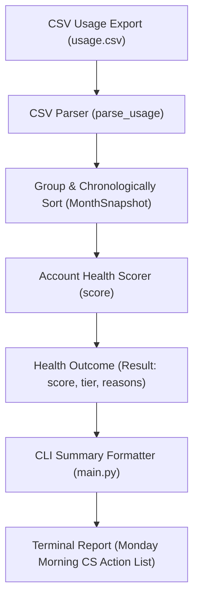

# Product Specification: Account Health Scorer (OPS-13)

**Status:** Approved  
**Milestone:** `account-health-scorer`  
**Target Release:** `v1.0.0`  

---

## 🎯 Executive Summary
* **Goal:** Deliver an automated, pure-Python account health scoring service that ingests monthly customer usage exports, calculates explainable risk scores with explicit deduction reasons, and classifies accounts into actionable health tiers.
* **Target User:** Customer Success Managers (CSMs) and Account Executives conducting weekly account prioritization and renewal risk assessments.
* **Business Value:** Proactively identify deteriorating accounts before churn/cancellation requests occur, providing human-interpretable risk drivers ("why" the account is degraded) to focus Monday morning outreach campaigns.

---

## 🛠️ User Stories & Workflows

### User Stories
- **Story 1 (CLI Ingestion & Reporting):** As a Customer Success Manager, I want to run the account health CLI tool against our monthly CSV usage export so that I get a formatted, sorted list of all active accounts with their current health scores and tiers.
- **Story 2 (Explainable Risk Drivers):** As a Customer Success Manager, I want each degraded score to explicitly list the specific reasons that triggered deductions (e.g., seat drop, low logins, open tickets) so that I have immediate context when contacting the customer.
- **Story 3 (Deterministic Health Tiers):** As an Account Executive, I want scores categorized into clear health tiers (`HEALTHY`, `MEDIUM`, `AT RISK`) so that our team can instantly filter and prioritize high-risk interventions.

### Operational Workflow


---

## 📋 Acceptance Criteria

### Core Scoring Contract

- **Scenario 1: Baseline Perfect Score (No Deductions)**
  - **Given** an account with usage history where the latest month shows stable or growing seats ($> 0.60 \times \text{prior peak}$ or single-month), $\ge 3$ logins, and $< 2$ open tickets
  - **When** `score(months)` is evaluated
  - **Then** the return `Result.score` MUST be `10`
  - **And** the `Result.tier` MUST be `"HEALTHY"`
  - **And** `Result.reasons` MUST be an empty list `[]`

- **Scenario 2: Seat Decline Rule Firing (−4 points)**
  - **Given** an account with multiple recorded months where the prior peak `seats_active` $> 0$ and the latest month's `seats_active` is less than or equal to $60\%$ (a decline of $40\%$ or more) of the maximum `seats_active` across all prior recorded months
  - **When** `score(months)` is evaluated
  - **Then** `4` points MUST be deducted from the base score
  - **And** `"seats down sharply"` MUST be included in `Result.reasons`

- **Scenario 3: Single-Month & Zero-Peak Seat Decline Exemption**
  - **Given** an account with either a single recorded month in its usage history OR where all prior recorded months had `seats_active == 0`
  - **When** `score(months)` is evaluated
  - **Then** the seat decline rule MUST NOT fire
  - **And** `"seats down sharply"` MUST NOT be present in `Result.reasons`

- **Scenario 4: Low Engagement Rule Firing (−3 points)**
  - **Given** an account whose latest recorded month has fewer than 3 logins (`logins < 3`)
  - **When** `score(months)` is evaluated
  - **Then** `3` points MUST be deducted from the score
  - **And** `"low engagement"` MUST be included in `Result.reasons`

- **Scenario 5: Unresolved Support Load Rule Firing (−2 points)**
  - **Given** an account whose latest recorded month has 2 or more open tickets (`tickets_open >= 2`)
  - **When** `score(months)` is evaluated
  - **Then** `2` points MUST be deducted from the score
  - **And** `"unresolved support load"` MUST be included in `Result.reasons`

- **Scenario 6: Deterministic Reason Ordering & Cumulative Deductions**
  - **Given** an account that triggers multiple deduction rules
  - **When** `score(months)` is evaluated
  - **Then** the total score MUST reflect the sum of all applicable deductions
  - **And** `Result.reasons` MUST preserve the deterministic rule evaluation order:
    1. `"seats down sharply"`
    2. `"low engagement"`
    3. `"unresolved support load"`

- **Scenario 7: Score Lower Bound (Zero Floor)**
  - **Given** an account where cumulative deductions exceed 10 points
  - **When** `score(months)` is evaluated
  - **Then** `Result.score` MUST be defensively clamped at `0` (`max(0, 10 - sum(deductions))`)

- **Scenario 8: Health Tier Boundaries**
  - **Given** a final calculated score
  - **When** `Result.tier` is assigned
  - **Then** scores in range `[8, 10]` MUST be classified as `"HEALTHY"`
  - **And** scores in range `[5, 7]` MUST be classified as `"MEDIUM"`
  - **And** scores in range `[0, 4]` MUST be classified as `"AT RISK"`

---

### Ingestion & Parsing Contract

- **Scenario 9: Arbitrary CSV Row Ordering, Header Handling & Chronological Sorting**
  - **Given** a CSV text input containing usage rows
  - **When** `parse_usage(csv_text)` is executed
  - **Then** any header matching `account_id,month,seats_active,logins,tickets_open` MUST be skipped
  - **And** entries MUST be grouped by `account_id` (trimmed of leading/trailing whitespace)
  - **And** if multiple rows exist for the same `(account_id, month)`, the last encountered row MUST be retained
  - **And** each account's list of `MonthSnapshot` objects MUST be sorted strictly in ascending chronological order by `month` (`YYYY-MM`)
  - **And** accounts with zero valid usage rows MUST be omitted from the output dictionary

- **Scenario 10: Blank Metric Coercion**
  - **Given** a CSV row where `seats_active`, `logins`, or `tickets_open` is empty, blank, or whitespace
  - **When** `parse_usage(csv_text)` parses the row
  - **Then** the blank metric value MUST be coerced to integer `0`

---

## 🚨 Constraints & Architecture

1. **Pure Function Discipline (`scorer/usage.py`):**
   - Must contain zero file system, environment, or network I/O.
   - `parse_usage(csv_text: str) -> dict[str, list[MonthSnapshot]]` accepts raw string input and produces structured domain objects.
   - `score(months: list[MonthSnapshot]) -> Result` accepts snapshots and returns a deterministic `Result`.
2. **Deterministic Tie-Breaking & Peak Calculation:**
   - Peak seats are evaluated strictly over all prior months ($m_1, m_2, \dots, m_{n-1}$), excluding the latest month ($m_n$).
   - If multiple prior months share the same peak value, that maximum is used.
3. **Immutability:**
   - `MonthSnapshot` and `Result` dataclasses MUST be frozen (`frozen=True`).
4. **Empty Input Defense:**
   - Accounts without recorded months are omitted during `parse_usage()`.
   - If `score()` is invoked with an empty list (`months = []`), it MUST raise `ValueError("Cannot score empty month history")`.

---

## 📖 Decisions & Rule Matrix

| ID | Rule | Description & Rationale | Traceability Reference |
|---|---|---|---|
| **D-1** | Seat Decline Calculation | Compare latest month seats to maximum peak across all *prior* recorded months ($m_1 \dots m_{n-1}$). Deduct 4 points if decline $\ge 40\%$ and prior peak $> 0$. | Scenario 2 |
| **D-2** | Single-Month & Zero-Peak Exemption | Single-month accounts and accounts with prior peak $= 0$ never trigger seat decline. | Scenario 3 |
| **D-3** | Low Engagement Deduction | Deduct 3 points if latest month `logins < 3`. | Scenario 4 |
| **D-4** | Unresolved Support Deduction | Deduct 2 points if latest month `tickets_open >= 2`. | Scenario 5 |
| **D-5** | Reason Ordering | Reasons list MUST preserve strict order: `"seats down sharply"`, `"low engagement"`, `"unresolved support load"`. | Scenario 6 |
| **D-6** | Score Lower Bound | `Result.score` is floored at `0` (`max(0, raw_score)`). | Scenario 7 |
| **D-7** | Tier Boundaries | `8..10` → `"HEALTHY"`, `5..7` → `"MEDIUM"`, `0..4` → `"AT RISK"`. Score `5` is `"MEDIUM"`. | Scenario 8 |
| **D-8** | Chronological Sorting & Header Skip | `parse_usage` skips CSV header and sorts snapshots chronologically by month ascending per account. | Scenario 9 |
| **D-9** | Blank Field Coercion | Blank/whitespace `seats_active`, `logins`, or `tickets_open` coerced to `0`. | Scenario 10 |
| **D-10** | Empty Input Defense | `score([])` raises `ValueError`. | Constraint 4 |

---

## 🎨 CLI Output Specification (`scorer/main.py`)

- Standard format per account line:
  `{account:<10} {score:>2}  {tier:<8} {reasons}`
- When an account has no deduction reasons, format the reasons field as `"-"`.
- Output accounts sorted alphabetically by `account_id`.

#### Standard CLI Output Example:
```text
acme        6  MEDIUM   seats down sharply
globex      6  MEDIUM   seats down sharply
hooli      10  HEALTHY  -
initech     5  MEDIUM   low engagement, unresolved support load
umbrella   10  HEALTHY  -
vandelay    6  MEDIUM   seats down sharply
```
