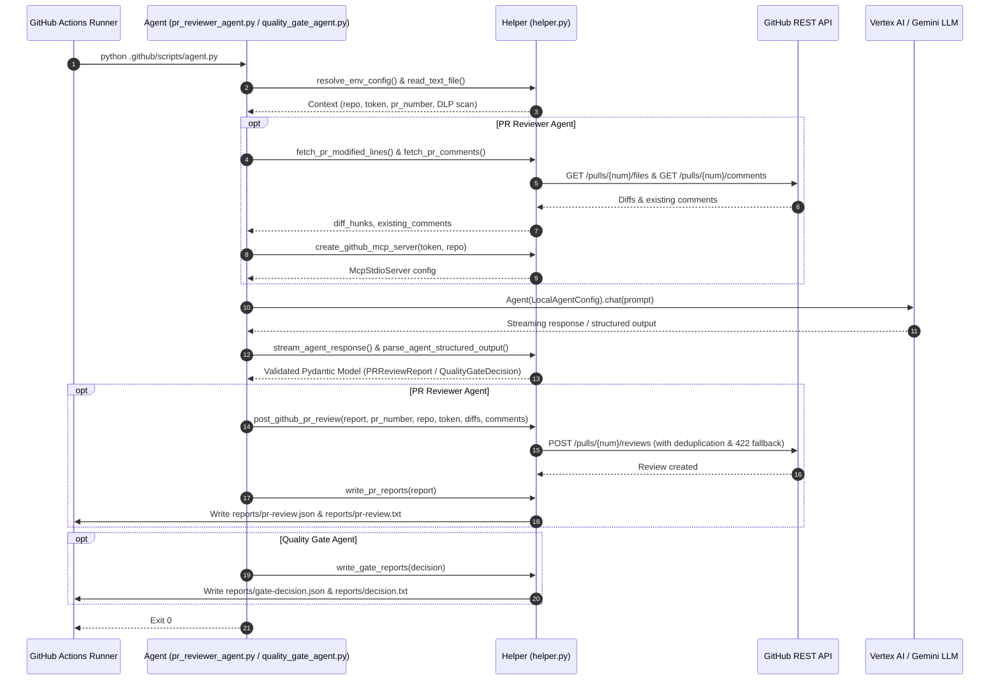

# Product Specification: CI/CD Agent Modularization and Reusable Helper Architecture

**Status:** Approved  
**Milestone:** `ci-cd-agents-modularization`  
**Target Release:** `v1.1.0`  
**Jira Ticket:** `OPS-24`  

---

## 🎯 Executive Summary
*   **Goal:** Refactor and modularize `.github/scripts/pr_reviewer_agent.py` and `.github/scripts/quality_gate_agent.py` by extracting all shared GitHub REST API client operations, file I/O and report serialization, environment resolution, and agent response streaming/parsing into a dedicated, reusable `.github/scripts/helper.py` module.
*   **Target User:** DevOps Engineers, Security Reviewers, CI/CD Pipeline Developers, and Release Engineers.
*   **Business Value:** Minimizes code duplication, enforces Single Responsibility Principle across CI agents, makes agent scripts concise, readable, and focused purely on prompts and Gemini API configurations, while maintaining 100% test coverage and backwards compatibility.

---

## 🛠️ User Stories & Workflows

### User Stories
- **Story 1 (Clean & Minimal Agent Definitions):** As a Developer inspecting `.github/scripts/pr_reviewer_agent.py` or `.github/scripts/quality_gate_agent.py`, I want the agent files to be concise and uncluttered, showing only the Pydantic schemas, prompt templates, agent configuration, and Gemini SDK API calls without hundreds of lines of REST API boilerplate.
- **Story 2 (Reusable CI Helper Utilities):** As a Platform Engineer adding a new automated CI agent in the future, I want a well-structured `.github/scripts/helper.py` library providing pre-tested routines for GitHub diff parsing, comment deduplication, review submission, report persistence, and response streaming.
- **Story 3 (Zero Pipeline Disruption):** As a Release Manager, I want the modularization to be 100% backward compatible so that existing test suites (`test_pr_reviewer_agent.py`, `test_quality_gate_agent.py`, `test_pr_reviewer_acceptance.py`, `test_quality_gate_acceptance.py`) and CI workflows continue executing with zero regressions.
- **Story 4 (Deterministic Fail-Closed Gate):** As a Security Officer, I want the quality gate to preserve its fail-closed integrity when reports are missing or security violations are detected.

### Architectural Sequence Workflow

---

## 📋 Acceptance Criteria

### Component 1: Shared Helper Module (`.github/scripts/helper.py`)
- **AC 1.1 (GitHub REST Operations):** Encapsulates `sanitize_and_validate_repo`, `fetch_pr_modified_lines`, `fetch_pr_comments`, `is_duplicate_comment`, `validate_and_sanitize_findings`, `send_github_review_sync`, `send_github_issue_comment_sync`, and `post_github_pr_review`.
- **AC 1.2 (Formatting & Reporting):** Encapsulates `format_pr_review_text`, `format_text_decision`, `write_json_and_text_reports`, `write_pr_reports`, and `write_gate_reports`.
- **AC 1.3 (Environment & Agent Utilities):** Encapsulates `resolve_env_config`, `read_text_file`, `ensure_directory`, `create_github_mcp_server`, `stream_agent_response`, and `parse_agent_structured_output`.
- **AC 1.4 (Alias Support):** Provides private symbol aliases (`_sanitize_and_validate_repo`, `_is_duplicate_comment`, `_send_github_review_sync`, `_send_github_issue_comment_sync`, `_write_pr_reports`, `_write_reports`) for seamless backward compatibility.

### Component 2: PR Reviewer Agent (`.github/scripts/pr_reviewer_agent.py`)
- **AC 2.1 (Minimal Script Footprint):** Contains only schemas (`PRFindingSeverity`, `ReviewStatus`, `InlineFinding`, `PRReviewReport`), system instructions, prompt assembly, `LocalAgentConfig`, `run_pr_review()`, and CLI `main()`.
- **AC 2.2 (Re-exports):** Re-exports all legacy helper symbols so existing test suites import cleanly.
- **AC 2.3 (Preserved Behavior):** Passes all existing unit and acceptance tests (`test_pr_reviewer_agent.py`, `test_pr_reviewer_acceptance.py`).

### Component 3: Quality Gate Agent (`.github/scripts/quality_gate_agent.py`)
- **AC 3.1 (Minimal Script Footprint):** Contains only schemas (`SeverityLevel`, `ViolationCategory`, `FailureDetail`, `QualityGateDecision`), system instructions, prompt assembly, `LocalAgentConfig`, `evaluate_quality_gate()`, and CLI `main()`.
- **AC 3.2 (Fail-Closed Enforcement):** Preserves deterministic fail-closed safety checks for missing DLP scan reports and missing PR review reports.
- **AC 3.3 (Re-exports):** Re-exports legacy symbols (`format_text_decision`, `_write_reports`).
- **AC 3.4 (Preserved Behavior):** Passes all existing unit and acceptance tests (`test_quality_gate_agent.py`, `test_quality_gate_acceptance.py`).

### Component 4: Helper Test Suite (`.github/scripts/tests/test_helper.py`)
- **AC 4.1 (Unit Test Coverage):** Contains comprehensive tests validating every function in `helper.py` in isolation.
- **AC 4.2 (Mocking & Error Handling):** Verifies network error fallbacks, 422 review fallbacks, timeout handling, and malformed JSON recovery.

---

## 🚨 Constraints & Edge Cases

1. **Strict Zero Regressions:** No changes may break existing test fixtures, assertions, or imports.
2. **Deterministic Exit Codes:** Agent scripts exit `0` upon report writing; gate failures are recorded in `reports/gate-decision.json` (`passed=False`).
3. **Pydantic Model Purity:** Schema validation invariants and field definitions remain identical.

---

## 📖 Decisions & Rule Matrix

| ID | Rule | Description & Rationale | Traceability Reference |
|---|---|---|---|
| **D-1** | Extract shared logic to `helper.py` | Centralizes GitHub REST API, I/O, streaming, and formatting into `.github/scripts/helper.py`. | AC 1.1, AC 1.2, AC 1.3 |
| **D-2** | Ultra-lean agent scripts | Keeps `pr_reviewer_agent.py` and `quality_gate_agent.py` minimal, showing prompts, configs, and Gemini API calls only. | AC 2.1, AC 3.1 |
| **D-3** | Backward-compatible re-exports | Re-exports all helper symbols from agent scripts to ensure zero import breakage. | AC 2.2, AC 3.3 |
| **D-4** | Unified environment resolver | Implements `helper.resolve_env_config()` for consistent CLI and environment parameter lookup. | AC 1.3 |
| **D-5** | Unified report serializer | Standardizes atomic JSON and plaintext file writes in `helper.py`. | AC 1.2 |
| **D-6** | Unified response streaming | Consolidates async chunk iteration and console logging in `helper.stream_agent_response()`. | AC 1.3 |
| **D-7** | Robust structured output parser | Standardizes Pydantic model validation from raw LLM responses. | AC 1.3 |
| **D-8** | Dedicated helper test suite | Authors `.github/scripts/tests/test_helper.py` covering all helper functions in isolation. | AC 4.1, AC 4.2 |
| **D-9** | Complete test suite passing | Guarantees all existing test files pass without modification. | AC 2.3, AC 3.4 |
| **D-10** | Public and private aliases | Exports both snake_case and underscore-prefixed names for all helpers. | AC 1.4 |
