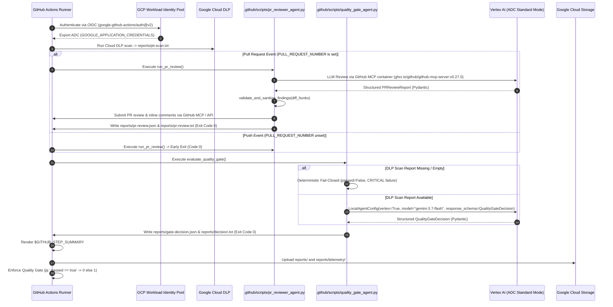

# Technical Plan: CI/CD Antigravity Python SDK Migration

## 🔍 Analysis & Context

*   **Objective:** Modernize the repository's CI/CD Quality Gate and PR Code Review pipeline ([`.github/workflows/source-code-pii-review.yml`](file:///Users/yannipeng/git-projects/workshop-agentic-sdlc-lab/.github/workflows/source-code-pii-review.yml)) by migrating from the legacy `agy` CLI to the **Google Antigravity Python SDK** (`google-antigravity`). The new architecture enforces keyless Vertex AI Application Default Credentials (ADC) via Workload Identity Federation (WIF), strict Pydantic structured output models, deterministic quality gate decisions, and line-level PR code reviews via GitHub MCP.
*   **Affected Files:**
    *   `pyproject.toml` (Pytest configuration & development dependency declarations)
    *   `.github/__init__.py` (Root .github package marker)
    *   `.github/scripts/__init__.py` (CI scripts package marker)
    *   `.github/scripts/quality_gate_agent.py` (Quality Gate Decision Agent script using `google-antigravity` & Pydantic)
    *   `.github/scripts/pr_reviewer_agent.py` (PR Code & PII Reviewer Agent script using `google-antigravity`, GitHub MCP, & Pydantic)
    *   `.github/scripts/tests/__init__.py` (CI test package marker)
    *   `.github/scripts/tests/test_quality_gate_agent.py` (Unit and contract test suite for Quality Gate agent)
    *   `.github/scripts/tests/test_pr_reviewer_agent.py` (Unit and contract test suite for PR Reviewer agent)
    *   `.github/workflows/source-code-pii-review.yml` (Transformed GitHub Actions workflow)
    *   `plans/active_milestones/ci-cd-agy-sdk-migration/spec.md` (Product & Interface Contract Specification)
*   **Key Dependencies:**
    *   `google-antigravity` (Antigravity Python SDK: `Agent`, `LocalAgentConfig`, `types.McpStdioServer`)
    *   `pydantic>=2.0.0,<3.0.0` (`BaseModel`, `Field`, `model_validator`, `Enum`)
    *   `pytest>=8.0.0`, `pytest-asyncio` / standard library `unittest.mock` (Mocking SDK Agent interactions and file I/O)
    *   `google-github-actions/auth@v2` (WIF keyless OIDC authentication)
    *   `actions/setup-python@v5` (Python 3.11 runtime environment in GitHub Actions)
*   **Risks & Edge Cases:**
    1.  **Fail-Closed Policy on Missing DLP Scan:** If `reports/pii-scan.txt` is missing, unreadable, or empty (0 bytes), the Quality Gate agent must deterministically evaluate `passed = False` with a `CRITICAL` severity `SECURITY_VULNERABILITY` failure immediately without calling Vertex AI rather than crashing with `FileNotFoundError` or relying on LLM hallucination (cites `# D-7`).
    2.  **Push vs. Pull Request Event Divergence:**
        *   Push events (non-PR) do not have `PULL_REQUEST_NUMBER`. `pr_reviewer_agent.py` must exit gracefully with return code `0` immediately without calling LLM or MCP containers (cites `# D-5`).
        *   On push events, `quality_gate_agent.py` must permit missing `reports/pr-review.txt` with default fallback text without failing the gate.
        *   On PR events (`PULL_REQUEST_NUMBER` is set), missing `reports/pr-review.txt` indicates a failed prior step and MUST cause gate failure (cites `# D-7`).
    3.  **Invalid Diff Coordinates / GitHub API 422 Errors:** Inline review comments on lines outside modified PR diff hunks fail with HTTP 422. `pr_reviewer_agent.py` must validate line coordinates with `validate_and_sanitize_findings()` and fall back to top-level review comments when line numbers are invalid or outside modified diff hunks (cites `# D-12`).
    4.  **Separation of Agent Execution vs. CI Gate Enforcement:** `quality_gate_agent.py` exits `0` upon successfully generating report artifacts (`reports/gate-decision.json` and `reports/decision.txt`), allowing downstream telemetry archival and step summary generation to run unconditionally. The dedicated `Enforce Quality Gate` step halts the workflow with exit code `1` if `passed != true` (cites `# D-9`).
    5.  **Pure Function / Core Scorer Isolation:** The core scoring package under `scorer/` remains pure Python with zero cloud or CI dependencies (cites `# D-8`).

---

## 🏗️ Architecture & Component Interaction



---

## 📋 Task Execution (Parallel Groups)

### Group 1 (Foundation Setup & Parallel Agent Implementation)
- [ ] **Task 1.0 (Prerequisite Foundation):** Configure `pyproject.toml` dependencies & pytest options, initialize package markers (`.github/__init__.py`, `.github/scripts/__init__.py`), and run `uv sync`.
- [ ] **Task 1.A (Parallel):** Implement Quality Gate Agent (`.github/scripts/quality_gate_agent.py`) and Unit/Contract Test Suite (`.github/scripts/tests/test_quality_gate_agent.py`).
- [ ] **Task 1.B (Parallel):** Implement PR Reviewer Agent (`.github/scripts/pr_reviewer_agent.py`) and Unit/Contract Test Suite (`.github/scripts/tests/test_pr_reviewer_agent.py`).

### Group 2 (Sequential Execution - Depends on Group 1)
- [ ] **Task 2.A:** Modernize GitHub Actions Workflow (`.github/workflows/source-code-pii-review.yml`) and End-to-End Pipeline Verification.

---

## 📝 Step-by-Step Implementation Details

### Group 1 (Foundation & Parallel Execution)

#### Task 1.0: Foundation Setup & Package Initialization

1.  **Step 1 (Configure `pyproject.toml`):**
    *   Update `pyproject.toml` to declare dependencies in the `dev` dependency group:
        ```toml
        [dependency-groups]
        dev = [
            "pytest>=8",
            "pytest-asyncio>=0.23.0",
            "pydantic>=2.0.0,<3.0.0",
            "google-antigravity>=0.1.0",
        ]
        ```
    *   Update `[tool.pytest.ini_options]` in `pyproject.toml` to include workspace root and CI test paths:
        ```toml
        [tool.pytest.ini_options]
        pythonpath = [".", "scorer"]
        testpaths = ["scorer/tests", ".github/scripts/tests"]
        asyncio_mode = "auto"
        ```
2.  **Step 2 (Initialize Package Markers):**
    *   Create empty marker files:
        *   `.github/__init__.py`
        *   `.github/scripts/__init__.py`
        *   `.github/scripts/tests/__init__.py`
3.  **Step 3 (Synchronize Virtual Environment):**
    *   Execute `uv sync` to ensure all declared packages and lockfile entries are resolved and installed in the active environment.
4.  **Step 4 (Verification):**
    *   Run `uv run pytest -q` and verify existing scorer tests continue to pass with expanded pythonpath.

---

#### Task 1.A: Quality Gate Agent (`.github/scripts/quality_gate_agent.py`) & Unit Test Suite

1.  **Step 1 (The Unit Test Harness):** Author comprehensive unit and contract tests in `.github/scripts/tests/test_quality_gate_agent.py` covering:
    *   **Pydantic Model Validation & Enums:**
        *   `SeverityLevel` values (`CRITICAL`, `HIGH`, `MEDIUM`, `LOW`).
        *   `ViolationCategory` values (`PII_LEAK`, `CREDENTIAL_LEAK`, `SECURITY_VULNERABILITY`, `ARCHITECTURAL_DEFECT`).
        *   `FailureDetail` instantiation and serialization.
        *   `QualityGateDecision` invariant validation:
            *   `passed=True` with `failures=[]` succeeds.
            *   `passed=True` with `failures=[...]` raises `ValueError("QualityGateDecision cannot be passed=True with non-empty failures")` (cites `# D-3`).
            *   `passed=False` with `failures=[]` raises `ValueError("QualityGateDecision cannot be passed=False with empty failures")` (cites `# D-3`).
            *   `passed=False` with populated `failures` succeeds.
    *   **Evaluation Scenarios (Mocking Antigravity `Agent`):**
        *   *Scenario 1 (Clean Pass):* Mocked response returns `passed=True, summary="All checks passed", failures=[]`. Asserts `reports/gate-decision.json` contains valid JSON, `reports/decision.txt` starts with `GATE_PASSED`, and return code is `0` (cites `# D-3`, `# D-6`).
        *   *Scenario 2 (Security/DLP Failure):* Mocked response returns `passed=False, failures=[FailureDetail(category=ViolationCategory.PII_LEAK, component="fixtures/usage.csv", severity=SeverityLevel.CRITICAL, reason="Detected API_KEY", remediation="Redact key")]`. Asserts `reports/gate-decision.json` is populated, `reports/decision.txt` starts with `GATE_FAILED` and lists the failure, and return code is `0` (cites `# D-3`, `# D-6`, `# D-9`).
        *   *Scenario 3 (Deterministic Fail-Closed on Missing/Empty DLP Report):* Missing or empty (0 bytes) `reports/pii-scan.txt` triggers immediate deterministic fail-closed evaluation without calling LLM, returning `passed=False` with `ViolationCategory.SECURITY_VULNERABILITY` and `SeverityLevel.CRITICAL` citing missing DLP report (cites `# D-7`).
        *   *Scenario 4 (Missing PR Review on Push vs. PR):* Unset `PULL_REQUEST_NUMBER` allows missing PR review report with fallback text; set `PULL_REQUEST_NUMBER` with missing PR review evaluates as gate failure (cites `# D-7`).
        *   *Scenario 5 (Telemetry & Output Directory Creation):* Validates `reports/telemetry/quality_gate_agent` directory is created and configured as `app_data_dir` in `LocalAgentConfig` (cites `# D-10`).
    *   *Target File:* `.github/scripts/tests/test_quality_gate_agent.py`

2.  **Step 2 (The Implementation):** In `.github/scripts/quality_gate_agent.py`:
    *   Define Pydantic models:
        ```python
        from enum import Enum
        from pydantic import BaseModel, Field, model_validator

        class SeverityLevel(str, Enum):
            CRITICAL = "CRITICAL"
            HIGH = "HIGH"
            MEDIUM = "MEDIUM"
            LOW = "LOW"

        class ViolationCategory(str, Enum):
            PII_LEAK = "PII_LEAK"
            CREDENTIAL_LEAK = "CREDENTIAL_LEAK"
            SECURITY_VULNERABILITY = "SECURITY_VULNERABILITY"
            ARCHITECTURAL_DEFECT = "ARCHITECTURAL_DEFECT"

        class FailureDetail(BaseModel):
            category: ViolationCategory
            component: str
            severity: SeverityLevel
            reason: str
            remediation: str

        class QualityGateDecision(BaseModel):
            passed: bool
            summary: str
            failures: list[FailureDetail] = Field(default_factory=list)

            @model_validator(mode="after")
            def validate_consistency(self) -> "QualityGateDecision":
                if self.passed and len(self.failures) > 0:
                    raise ValueError("QualityGateDecision cannot be passed=True with non-empty failures")
                if not self.passed and len(self.failures) == 0:
                    raise ValueError("QualityGateDecision cannot be passed=False with empty failures")
                return self
        ```
    *   Implement `async def evaluate_quality_gate(enforce: bool = False) -> int`:
        1.  **Deterministic DLP Verification (Fail-Closed):** Inspect `reports/pii-scan.txt`.
            *   If `reports/pii-scan.txt` does not exist, cannot be read, or is empty (0 bytes), bypass Vertex AI and deterministically construct:
                ```python
                decision = QualityGateDecision(
                    passed=False,
                    summary="Quality Gate Failed: Required Cloud DLP scan report is missing, unreadable, or empty.",
                    failures=[
                        FailureDetail(
                            category=ViolationCategory.SECURITY_VULNERABILITY,
                            component="Cloud DLP",
                            severity=SeverityLevel.CRITICAL,
                            reason="Required Cloud DLP scan report (reports/pii-scan.txt) is missing, unreadable, or empty",
                            remediation="Ensure Cloud DLP scan step executes successfully before quality gate evaluation",
                        )
                    ],
                )
                ```
                Write `reports/gate-decision.json` and `reports/decision.txt`, and return `0` (or `1` if `enforce=True`).
        2.  **PR Review Context Resolution:**
            *   Inspect `PULL_REQUEST_NUMBER`.
            *   If set, verify `reports/pr-review.txt` / `reports/pr-review.json` exists. If missing on active PR, inject high-severity failure into context.
            *   If unset (push event), supply default fallback text `"No PR review report available (push event or non-PR)."` without failing the gate.
        3.  **LocalAgentConfig Initialization:**
            *   `model="gemini-3.7-flash"` with medium thinking budget (minimum Gemini 3.5 Flash, cites `# D-2`)
            *   `vertex=True`
            *   `project=os.environ.get("GOOGLE_CLOUD_PROJECT")`
            *   `location=os.environ.get("GOOGLE_CLOUD_LOCATION", "us-central1")`
            *   `response_schema=QualityGateDecision`
            *   `app_data_dir=os.path.abspath("reports/telemetry/quality_gate_agent")`
        4.  **Execute Agent Chat:** Execute `agent.chat(prompt)`, extract `raw_output = await response.structured_output()`, and validate with `decision = QualityGateDecision.model_validate(raw_output)`.
        5.  **Write Dual-Output Artifacts:** Ensure directory `reports/` exists, write `reports/gate-decision.json` (`model_dump_json(indent=2)`), and write formatted `reports/decision.txt` (`GATE_PASSED` or `GATE_FAILED` + enumerated breakdown).
        6.  **Return Code:** Return exit code `0` by default (or `1` if `enforce=True` and `not decision.passed`).
    *   *Target File:* `.github/scripts/quality_gate_agent.py`

3.  **Step 3 (The Verification):**
    *   Run `uv run pytest .github/scripts/tests/test_quality_gate_agent.py -v` and ensure all test cases pass.

---

#### Task 1.B: PR Reviewer Agent (`.github/scripts/pr_reviewer_agent.py`) & Unit Test Suite

1.  **Step 1 (The Unit Test Harness):** Author comprehensive unit and contract tests in `.github/scripts/tests/test_pr_reviewer_agent.py` covering:
    *   **Pydantic Model Validation & Enums:**
        *   `ReviewStatus` values (`APPROVE`, `REQUEST_CHANGES`, `COMMENT`).
        *   `PRFindingSeverity` values (`BLOCKER`, `WARNING`, `SUGGESTION`, `INFO`).
        *   `InlineFinding` fields (`file_path`, `line_number`, `severity`, `title`, `details`, `suggestion`, `pii_leak`).
        *   `PRReviewReport` invariant/consistency validator: if any finding has `severity == PRFindingSeverity.BLOCKER` or `pii_leak == True`, `overall_status` must equal `ReviewStatus.REQUEST_CHANGES` (cites `# D-4`).
    *   **PR Review Execution Scenarios:**
        *   *Scenario 6 (Non-PR / Push Event Skip):* Unset or empty `PULL_REQUEST_NUMBER` prints `"No pull request number provided; skipping PR review."` and returns `0` without invoking `Agent` or Docker (cites `# D-5`).
        *   *Scenario 5 (Active PR Review via Mocked Agent & Environment Resolution):* With `PULL_REQUEST_NUMBER="42"`, `GH_TOKEN="token"`, and `GITHUB_REPOSITORY="org/repo"` (or `REPOSITORY="org/repo"`), verifies `LocalAgentConfig` creates `types.McpStdioServer` with `docker run -i --rm -e GITHUB_PERSONAL_ACCESS_TOKEN -e GITHUB_REPOSITORY ghcr.io/github/github-mcp-server:v0.27.0` (cites `# D-11`).
        *   *Scenario 7 (Diff Coordinate Validation & Fallback):* Helper function `validate_and_sanitize_findings()` verifies that findings with valid `file_path` and `line_number` in the diff are tagged for inline comments, while findings with `line_number=None` or out-of-hunk line numbers fall back to the top-level review body (preventing GitHub API 422 errors) (cites `# D-12`).
        *   *Comment Mutation Dispatch:* Verifies execution logic that posts top-level reviews and inline comments to GitHub via MCP tools or GitHub API.
        *   *Dual-Output Validation:* Verifies creation of `reports/pr-review.json` and human-readable `reports/pr-review.txt` (cites `# D-6`).
        *   *Telemetry Isolation:* Verifies `app_data_dir` is set to `reports/telemetry/pr_review_agent` (cites `# D-10`).
    *   *Target File:* `.github/scripts/tests/test_pr_reviewer_agent.py`

2.  **Step 2 (The Implementation):** In `.github/scripts/pr_reviewer_agent.py`:
    *   Define Pydantic models:
        ```python
        from enum import Enum
        from pydantic import BaseModel, Field, model_validator

        class ReviewStatus(str, Enum):
            APPROVE = "APPROVE"
            REQUEST_CHANGES = "REQUEST_CHANGES"
            COMMENT = "COMMENT"

        class PRFindingSeverity(str, Enum):
            BLOCKER = "BLOCKER"
            WARNING = "WARNING"
            SUGGESTION = "SUGGESTION"
            INFO = "INFO"

        # Backwards compatibility alias
        ReviewSeverity = PRFindingSeverity

        class InlineFinding(BaseModel):
            file_path: str
            line_number: int | None = None
            severity: PRFindingSeverity
            title: str
            details: str
            suggestion: str = ""
            pii_leak: bool = False

        class PRReviewReport(BaseModel):
            overall_status: ReviewStatus
            summary: str
            findings: list[InlineFinding] = Field(default_factory=list)

            @model_validator(mode="after")
            def validate_status(self) -> "PRReviewReport":
                has_blocker = any(
                    f.severity == PRFindingSeverity.BLOCKER or f.pii_leak
                    for f in self.findings
                )
                if has_blocker and self.overall_status != ReviewStatus.REQUEST_CHANGES:
                    self.overall_status = ReviewStatus.REQUEST_CHANGES
                return self
        ```
    *   Implement `validate_and_sanitize_findings(findings: list[InlineFinding], diff_hunks: dict[str, list[int]]) -> tuple[list[InlineFinding], list[InlineFinding]]`:
        *   Separates findings into `inline_comments` (where `finding.file_path in diff_hunks` and `finding.line_number in diff_hunks[finding.file_path]`) and `fallback_comments` (where `line_number` is `None` or outside valid diff hunks).
    *   Implement `async def run_pr_review() -> int`:
        1.  **Check Pull Request Number:** Check `PULL_REQUEST_NUMBER`. If not set or empty, log `"No pull request number provided; skipping PR review."` and return `0`.
        2.  **Resolve Environment Variables:**
            *   `gh_token = os.environ.get("GH_TOKEN") or os.environ.get("GITHUB_TOKEN", "")`
            *   `repo = os.environ.get("GITHUB_REPOSITORY") or os.environ.get("REPOSITORY", "")`
            *   `pr_num = os.environ["PULL_REQUEST_NUMBER"]`
        3.  **Read Scan Inputs:** Read `reports/pii-scan.txt` safely (fallback to default message if missing).
        4.  **Configure GitHub MCP Stdio Server:**
            ```python
            github_mcp = types.McpStdioServer(
                name="github",
                command="docker",
                args=[
                    "run", "-i", "--rm",
                    "-e", "GITHUB_PERSONAL_ACCESS_TOKEN",
                    "-e", "GITHUB_REPOSITORY",
                    "ghcr.io/github/github-mcp-server:v0.27.0"
                ],
                env={
                    "GITHUB_PERSONAL_ACCESS_TOKEN": gh_token,
                    "GITHUB_REPOSITORY": repo,
                }
            )
            ```
        5.  **Configure LocalAgentConfig:**
            *   `model="gemini-3.7-flash"` with medium thinking budget (minimum Gemini 3.5 Flash, cites `# D-2`)
            *   `vertex=True`
            *   `project=os.environ.get("GOOGLE_CLOUD_PROJECT")`
            *   `location=os.environ.get("GOOGLE_CLOUD_LOCATION", "us-central1")`
            *   `mcp_servers=[github_mcp]`
            *   `response_schema=PRReviewReport`
            *   `app_data_dir=os.path.abspath("reports/telemetry/pr_review_agent")`
        6.  **Execute Agent Chat:** Execute `agent.chat(prompt)` and validate output into `report = PRReviewReport.model_validate(raw_output)`.
        7.  **Diff Coordinate Validation & Comment Mutation Dispatch:**
            *   Execute `inline_findings, fallback_findings = validate_and_sanitize_findings(report.findings, diff_hunks)`.
            *   Construct top-level review body including `report.summary`, overall status badge, and enumerated list of any fallback / unattached findings.
            *   Submit the pull request review via GitHub MCP tools (`github.create_pull_request_review` or GitHub REST API) using `event=report.overall_status.value` (`APPROVE`, `REQUEST_CHANGES`, `COMMENT`) and top-level comment body.
            *   Submit inline comments for `inline_findings` on valid `(file_path, line_number)` coordinates.
        8.  **Write Dual-Output Artifacts:** Ensure directory `reports/` exists, write `reports/pr-review.json` (`model_dump_json(indent=2)`), and write formatted `reports/pr-review.txt`.
        9.  **Return Code:** Return `0`.
    *   *Target File:* `.github/scripts/pr_reviewer_agent.py`

3.  **Step 3 (The Verification):**
    *   Run `uv run pytest .github/scripts/tests/test_pr_reviewer_agent.py -v` and ensure all test cases pass.

---

### Group 2 (Sequential Execution - Depends on Group 1)

#### Task 2.A: Modernize GitHub Actions Workflow (`.github/workflows/source-code-pii-review.yml`)

1.  **Step 1 (The Workflow Transformation):** Modify `.github/workflows/source-code-pii-review.yml`:
    *   **Authentication & Variables:**
        *   Retain WIF authentication step `google-github-actions/auth@v2` (cites `# D-1`).
        *   Remove `GEMINI_API_KEY`, `AGY_SETTINGS`, and `AGY_TELEMETRY_ENABLED` from `env` and steps.
        *   Set `GOOGLE_GENAI_USE_VERTEXAI: 'true'` and ensure `GOOGLE_CLOUD_LOCATION: ${{ secrets.GOOGLE_CLOUD_LOCATION || 'us-central1' }}` is exported (cites `# D-2`).
    *   **Python Runtime & Tooling:**
        *   Remove legacy `curl | bash` installation of `agy` CLI, PATH additions, cache steps for `agy`, and `.agents/mcp_config.json` generation.
        *   Add `actions/setup-python@v5` with `python-version: '3.11'` and `cache: 'pip'`.
        *   Add step `Install Python Dependencies`: `pip install google-antigravity "pydantic>=2.0.0,<3.0.0"` (cites `# D-8`).
    *   **Agent Script Invocation:**
        *   Update step `Run PR Auto-Review via Antigravity Code Reviewer (SDK)`:
            *   `if: github.event.pull_request.number != null`
            *   `env`: pass `GH_TOKEN: ${{ secrets.GITHUB_TOKEN }}`, `GITHUB_REPOSITORY: ${{ github.repository }}`, `REPOSITORY: ${{ github.repository }}`, `PULL_REQUEST_NUMBER: ${{ github.event.pull_request.number }}`, `GOOGLE_CLOUD_PROJECT: ${{ env.GOOGLE_CLOUD_PROJECT }}`, `GOOGLE_CLOUD_LOCATION: ${{ env.GOOGLE_CLOUD_LOCATION }}`
            *   `run: python .github/scripts/pr_reviewer_agent.py`
        *   Update step `Quality Gate Decision via Release Engineer Agent (SDK)`:
            *   `env`: pass `GOOGLE_CLOUD_PROJECT: ${{ env.GOOGLE_CLOUD_PROJECT }}`, `GOOGLE_CLOUD_LOCATION: ${{ env.GOOGLE_CLOUD_LOCATION }}`, `PULL_REQUEST_NUMBER: ${{ github.event.pull_request.number }}`
            *   `run: python .github/scripts/quality_gate_agent.py`
    *   **Step Summary & Telemetry Upload:**
        *   Update `Generate GitHub Actions Job Summary`:
            *   Check status using `reports/gate-decision.json` (`jq -e '.passed == true'`).
            *   Display status `GATE PASSED` or `GATE FAILED` in `$GITHUB_STEP_SUMMARY`.
            *   Embed formatted JSON decision block from `reports/gate-decision.json`.
        *   Update `Upload Audit Reports & Telemetry to GCS`:
            *   Upload entire `reports/` folder (including `reports/telemetry/`) to `gs://${{ env.GOOGLE_CLOUD_PROJECT }}-scan-reports/${{ github.run_id }}_${{ github.run_attempt }}` (cites `# D-10`).
    *   **Deterministic Quality Gate Enforcement Step:**
        *   Update step `Enforce Quality Gate`:
            *   Parse `reports/gate-decision.json`.
            *   If `passed == true`, print success message and exit `0`.
            *   If `passed == false` or file is missing/corrupt, print structured failure breakdown and exit `1` (cites `# D-9`, `# D-11`).
    *   *Target File:* `.github/workflows/source-code-pii-review.yml`

2.  **Step 2 (The Verification):**
    *   Validate YAML structure and syntax using a python yaml / linter script.
    *   Verify complete test suite passes: `uv run pytest -v`.

---

## 🧪 Global Testing Strategy

*   **CI Agent Unit & Contract Tests (`.github/scripts/tests/`):**
    *   Unit testing of Pydantic models, custom validators, and edge case invariants (`QualityGateDecision`, `PRReviewReport`, `InlineFinding`, `FailureDetail`, `PRFindingSeverity`).
    *   Deterministic fail-closed behavior on missing or empty Cloud DLP report files.
    *   Mocked asynchronous context manager tests for `Agent(config)` with Vertex AI Standard Mode configuration (`model="gemini-3.7-flash"` with medium thinking budget).
    *   Diff coordinate validation and mutation dispatch test cases (`validate_and_sanitize_findings()`).
    *   Dual-output file generation and formatting verification (`.json` and `.txt`).
    *   Graceful exit verification for non-PR push events.
*   **Core Scorer Isolation Tests (`scorer/tests/`):**
    *   Verify that adding CI scripts under `.github/scripts/` does NOT affect the existing core account health scoring service or contract tests.
*   **Global Test Execution Command:**
    ```bash
    uv run pytest -q
    ```

---

## 🗺️ Traceability Matrix (Decisions & Acceptance Criteria)

| Spec Decision ID | Spec Scenario | Technical Plan Task | Verification / Test Assertion in `.github/scripts/tests/` |
|---|---|---|---|
| **D-1** (WIF Keyless Auth) | Scenario 8 | Task 2.A | `source-code-pii-review.yml` utilizes `google-github-actions/auth@v2` without `GEMINI_API_KEY`. |
| **D-2** (Vertex AI Mode) | Scenario 1, 5, 8 | Task 1.A, 1.B, 2.A | `LocalAgentConfig(vertex=True, model="gemini-3.7-flash", project=..., location=...)` verified in agent initialization tests (medium thinking budget; minimum Gemini 3.5 Flash). |
| **D-3** (Pydantic Gate Schema) | Scenario 1, 2, 4 | Task 1.A | `test_quality_gate_agent.py` validates `QualityGateDecision` invariant validator and schema fields. |
| **D-4** (Pydantic PR Review Schema) | Scenario 5, 7 | Task 1.B | `test_pr_reviewer_agent.py` tests `PRFindingSeverity.BLOCKER` / `pii_leak=True` coercion to `ReviewStatus.REQUEST_CHANGES`. |
| **D-5** (Non-PR Early Exit) | Scenario 6 | Task 1.B | `test_pr_reviewer_agent.py` asserts return code `0` and zero LLM calls when `PULL_REQUEST_NUMBER` unset. |
| **D-6** (Dual-Output Contract) | Scenario 1, 2, 5 | Task 1.A, 1.B | Tests assert creation and contents of both `gate-decision.json`/`decision.txt` and `pr-review.json`/`pr-review.txt`. |
| **D-7** (Fail-Closed Safety) | Scenario 3 | Task 1.A | `test_quality_gate_agent.py` asserts missing `pii-scan.txt` results in immediate deterministic `passed=False` with `CRITICAL` severity. |
| **D-8** (Python Runner Std) | Scenario 9 | Task 1.0, 2.A | `pyproject.toml` defines dev dependencies; `source-code-pii-review.yml` specifies `actions/setup-python@v5` and `pip install`. |
| **D-9** (Exit Code Separation) | Scenario 2, 11 | Task 1.A, 2.A | `quality_gate_agent.py` returns `0` upon report generation; CI step `Enforce Quality Gate` handles exit `1`. |
| **D-10** (Telemetry Isolation) | Scenario 10 | Task 1.A, 1.B, 2.A | `LocalAgentConfig` configures `app_data_dir=reports/telemetry/...`; GCS step uploads `reports/`. |
| **D-11** (GitHub MCP Stdio) | Scenario 5 | Task 1.B | `test_pr_reviewer_agent.py` verifies `types.McpStdioServer` docker container parameters and env vars. |
| **D-12** (Diff Coordinate Fallback & Mutation) | Scenario 7 | Task 1.B | `test_pr_reviewer_agent.py` verifies coordinate validation, comment submission flow, and fallback to top-level PR comment body. |

---

## 🎯 Success Criteria

1.  **Strict Planning Separation:** No source code in `.github/scripts/` or `.github/workflows/` is modified during this planning phase.
2.  **Deterministic Test Suite:** Complete unit and contract test suite specified in `.github/scripts/tests/` with 100% decision and scenario coverage.
3.  **Parallel Execution Readiness:** Task 1.A and Task 1.B are completely decoupled for concurrent implementation by software engineer subagents in Phase 4.
4.  **Zero Key Dependency:** Full keyless WIF / Vertex AI ADC architecture documented without reliance on `GEMINI_API_KEY`.
5.  **Passing Test Suite:** Execution of `uv run pytest` succeeds cleanly once implemented.
