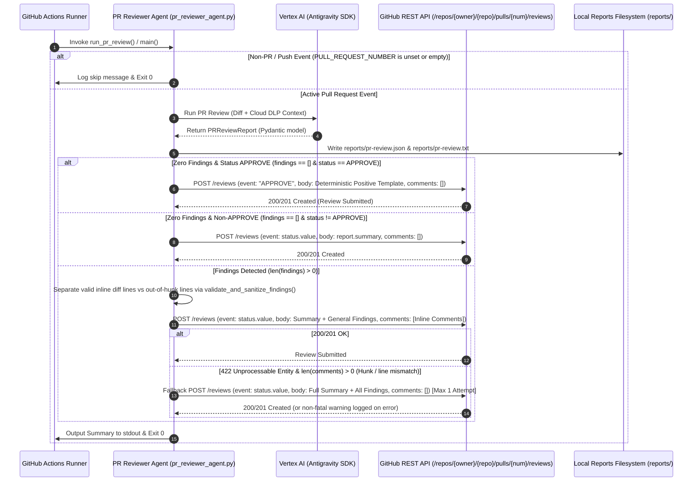

# Technical Plan: Automated GitHub PR Review & Positive Comment Posting

## 🔍 Analysis & Context

*   **Objective:** Enhance the Automated PR Reviewer Agent ([`.github/scripts/pr_reviewer_agent.py`](file:///Users/yannipeng/git-projects/workshop-agentic-sdlc-lab/.github/scripts/pr_reviewer_agent.py)) to submit formal GitHub Pull Request Reviews (`POST /repos/{owner}/{repo}/pulls/{pull_number}/reviews`), publishing positive encouraging approval comments when PRs are clean (`findings == []` and `overall_status == ReviewStatus.APPROVE`), submitting structured inline and top-level comments when code/security defects or comments are present, and handling non-PR events and API errors gracefully.
*   **Affected Files:**
    *   `.github/scripts/pr_reviewer_agent.py` (Core PR reviewer agent script: add `post_github_pr_review()`, positive review generation, inline comment mapping, and 422 fallback logic)
    *   `.github/scripts/tests/test_pr_reviewer_agent.py` (Unit and contract tests covering review submission, positive templates, error handling, and fallbacks)
    *   `.github/tests/test_pr_reviewer_acceptance.py` (Acceptance test suite verifying end-to-end PR review posting behaviors)
    *   `docs/spec.md` (Interface Contract Specification)
    *   `plans/active_milestones/pr-review-comment-posting/plan.md` (This technical plan)
*   **Key Dependencies:**
    *   `google-antigravity` (Antigravity Python SDK: `Agent`, `LocalAgentConfig`, `types.McpStdioServer`)
    *   `pydantic>=2.0.0,<3.0.0` (`BaseModel`, `Field`, `model_validator`, `Enum`)
    *   `pytest>=8.0.0`, `pytest-asyncio` / standard library `unittest.mock` (Mocking network requests, GitHub APIs, and agent chats)
    *   Standard library `urllib.request`, `urllib.error`, `json`, `asyncio` (Synchronous HTTP requests wrapped via `asyncio.to_thread` with 10s timeout)
*   **Risks & Edge Cases:**
    1.  **Author Self-Review Restrictions (GitHub API 422):** In GitHub Actions, submitting an `APPROVE` review on a PR created by the same actor (or bot token) can return HTTP 422 with message "Cannot review own pull request". When `comments == []`, the agent must log a warning and not enter an infinite retry loop (cites `# D-6`).
    2.  **Out-of-Hunk Line Number Drift (GitHub API 422):** If inline comments fail with HTTP 422 due to modified line coordinates mismatch, the agent must execute a bounded single fallback attempt consolidating all findings into the top-level review `body` with `comments: []` (cites `# D-3`, `# D-6`).
    3.  **Non-PR / Push Event Safety:** When `PULL_REQUEST_NUMBER` is unset or empty, the agent skips review submission and exits `0` without making any GitHub API or LLM calls (cites `# D-4`).
    4.  **Network Failures & Token Permission Issues:** Socket timeouts (10s limit) or HTTP 401/403 errors must be caught, logged as non-fatal warnings, and must never crash the CI runner (cites `# D-5`).
    5.  **Artifact Generation Guarantee:** Local report artifacts (`reports/pr-review.json` and `reports/pr-review.txt`) must always be written before attempting review posting to ensure persistence regardless of API outcome (cites `# D-7`).
    6.  **Parameter Priority & Repository Sanitization:** `sys.argv` > environment variables; whitespace, quotes, and `.git` suffix must be stripped from repository name with strict `owner/repo` validation (cites `# D-8`).
    7.  **Clean Separation of Concerns:** Core application (`scorer/`) remains completely untouched (cites `# D-8`).

---

## 🏗️ Architecture & Component Interaction



---

## 📋 Task Execution (Parallel Groups)

### Group 1 (Contract & Unit Test Harnesses - Parallel Execution)
- [x] **Task 1.0 (Prerequisite Interface Stubs):** Declare stub definitions for `post_github_pr_review()`, `POSITIVE_APPROVAL_TEMPLATE`, and `_sanitize_and_validate_repo()` in `.github/scripts/pr_reviewer_agent.py` (raising `NotImplementedError`) to prevent `ImportError` collection failures during initial test runs.
- [x] **Task 1.A:** Author Unit & Contract Tests in `.github/scripts/tests/test_pr_reviewer_agent.py` covering `post_github_pr_review()`, positive review payloads, status-to-event mapping, inline comment formatting, parameter precedence, network error resilience, bounded 422 fallback retry, and patch existing unit tests to mock review posting network calls.
- [x] **Task 1.B:** Author Acceptance Tests in `.github/tests/test_pr_reviewer_acceptance.py` covering end-to-end PR review posting behaviors, positive encouragement templates, and non-PR graceful skips with proper `sys.path` configuration.

### Group 2 (Implementation in `pr_reviewer_agent.py` - Sequential Execution, Depends on Group 1)
- [x] **Task 2.A:** Implement `post_github_pr_review()`, positive review generation, inline comment mapping, 422 fallback logic, repo sanitization, unified exit orchestration with `modified_files_diff` forwarding in `.github/scripts/pr_reviewer_agent.py`.

### Group 3 (Acceptance & Integration Validation - Sequential Execution, Depends on Group 2)
- [x] **Task 3.A:** Execute the full test suite (`uv run pytest -q`) and verify that all unit, contract, acceptance, and core scoring tests pass with 100% green status.

---

## 📝 Step-by-Step Implementation Details

### Group 1 (Contract & Unit Test Harnesses)

#### Task 1.0: Prerequisite Interface Stubs in `.github/scripts/pr_reviewer_agent.py`

1.  **Step 1 (Interface Stubbing):** In `.github/scripts/pr_reviewer_agent.py`, add stub signatures (cites `# D-1`, `# D-8`, `# D-10`):
    ```python
    POSITIVE_APPROVAL_TEMPLATE = ""

    def _sanitize_and_validate_repo(repo: str) -> Optional[tuple[str, str]]:
        raise NotImplementedError

    def _send_github_review_sync(
        owner: str,
        repo_name: str,
        pr_number: Union[str, int],
        token: str,
        payload: dict[str, Any],
        timeout: int = 10,
    ) -> tuple[int, str]:
        raise NotImplementedError

    async def post_github_pr_review(
        report: PRReviewReport,
        pr_number: Union[str, int],
        repo: str,
        token: str,
        modified_files_diff: Optional[dict[str, list[int]]] = None,
    ) -> bool:
        raise NotImplementedError
    ```
2.  **Step 2 (Verification):** Verify syntax and importability:
    ```bash
    uv run python -c "from .github.scripts.pr_reviewer_agent import post_github_pr_review, POSITIVE_APPROVAL_TEMPLATE; print('Stubs imported successfully')"
    ```

---

#### Task 1.A: Unit & Contract Tests in `.github/scripts/tests/test_pr_reviewer_agent.py`

1.  **Step 1 (The Unit Test Harness):** Author comprehensive unit and contract tests in `.github/scripts/tests/test_pr_reviewer_agent.py` covering:
    *   **Patch Existing Unit Tests for Network Safety:**
        *   Update `test_run_pr_review_mock_agent_approve`, `test_run_pr_review_mock_agent_config_and_telemetry`, and `test_run_pr_review_streams_thinking_and_output` to patch `post_github_pr_review` or mock `urllib.request.urlopen` so executing `run_pr_review` with test credentials does not attempt unmocked HTTP connections to GitHub API.
    *   **Positive Approval Review on Clean PR (Decision D-1, Scenario 1):**
        *   `test_post_github_pr_review_positive_approval_clean_pr`:
            *   Input: `PRReviewReport(overall_status=ReviewStatus.APPROVE, summary="Clean", findings=[])`.
            *   Mock `urllib.request.urlopen` returning HTTP 200/201.
            *   Asserts HTTP `POST` URL is `https://api.github.com/repos/owner/repo/pulls/42/reviews`.
            *   Asserts headers include `Authorization: Bearer mock-token`, `Accept: application/vnd.github+json`, `User-Agent: automated-pr-reviewer/1.0`, `X-GitHub-Api-Version: 2022-11-28`.
            *   Asserts JSON payload contains `event: "APPROVE"`, `comments: []`, and `body` matching canonical positive approval template:
                `"## ✅ Automated PR Review: APPROVED\n\nGreat job! No code defects, architectural issues, or Cloud DLP security findings were detected in this pull request. All changes look clean and ready to merge."`
            *   Asserts function returns `True`.
    *   **Zero Findings with Non-APPROVE Status (Decision D-9, Scenario 1b):**
        *   `test_post_github_pr_review_zero_findings_non_approve`:
            *   Input: `PRReviewReport(overall_status=ReviewStatus.COMMENT, summary="General comments", findings=[])` or `REQUEST_CHANGES`.
            *   Asserts payload `event` is `"COMMENT"` (or `"REQUEST_CHANGES"`), `body` is `"General comments"` (no positive approval phrasing), and `comments: []`.
            *   Asserts function returns `True`.
    *   **Structured Inline & Top-Level Comments (Decisions D-2, D-3, Scenario 2):**
        *   `test_post_github_pr_review_structured_inline_comments`:
            *   Input: `PRReviewReport` with `findings=[inline_finding, out_of_hunk_finding]` and `modified_files_diff={"scorer/usage.py": [10, 15]}`.
            *   Asserts payload contains `event: "REQUEST_CHANGES"` when blocker/PII present.
            *   Asserts `comments` list contains valid inline items `[{"path": "scorer/usage.py", "line": 15, "body": ...}]`.
            *   Asserts inline comment body follows format `**[SEVERITY] Title**\n\nDetails\n\n```suggestion\n...\n````.
            *   Asserts top-level `body` includes general/out-of-hunk findings.
    *   **Graceful Non-PR / Push Skip (Decision D-4, Scenario 3):**
        *   `test_run_pr_review_non_pr_skip_no_api_calls`:
            *   Asserts when `pr_number=None` or `""`, `run_pr_review` prints `"No pull request number provided; skipping PR review."`, makes 0 HTTP calls, and returns `None`.
    *   **Network & Credential Error Resilience (Decision D-5, Scenario 4):**
        *   `test_post_github_pr_review_network_error_resilience`:
            *   Mock `urlopen` raising `urllib.error.URLError("Connection refused")` or `TimeoutError`.
            *   Asserts error is caught, warning logged, function returns `False`, and no exception is raised.
        *   `test_post_github_pr_review_auth_error_resilience`:
            *   Mock `urlopen` raising `urllib.error.HTTPError(..., 401, "Unauthorized", ..., ...)`.
            *   Asserts warning logged, function returns `False`, no crash.
    *   **Bounded HTTP 422 Fallback Handling (Decision D-6, Scenario 5):**
        *   `test_post_github_pr_review_422_fallback_retry_success`:
            *   Mock `urlopen`: first call (with inline comments) raises `HTTPError(..., 422, "Unprocessable Entity", ...)`, second call (fallback retry with `comments: []` and consolidated `body`) succeeds (200).
            *   Asserts exactly 2 HTTP POST requests were made.
            *   Asserts fallback payload has `comments: []` and full findings in `body`.
            *   Asserts function returns `True`.
        *   `test_post_github_pr_review_422_no_retry_when_comments_empty`:
            *   Input has `comments: []` (e.g. author self-review on APPROVE).
            *   Mock `urlopen` raises `HTTPError(..., 422, "Unprocessable Entity", ...)`.
            *   Asserts exactly 1 HTTP request made (no redundant retry).
            *   Asserts warning logged and returns `False`.
        *   `test_post_github_pr_review_422_fallback_retry_failure`:
            *   Both initial and retry call return 422.
            *   Asserts at most 2 HTTP requests made, warning logged, returns `False`.
    *   **Local Artifact Dual-Output Preservation (Decision D-7, Scenario 6):**
        *   `test_run_pr_review_writes_artifacts_before_posting`:
            *   Asserts `reports/pr-review.json` and `reports/pr-review.txt` exist and are valid even if review posting encounters network failure.
    *   **Parameter Resolution & Repository Sanitization (Decision D-8, Scenario 7):**
        *   `test_post_github_pr_review_repo_sanitization`:
            *   Test inputs: `" org/repo.git "`, `"'owner/repo'"`, `"\"owner/repo\""`.
            *   Asserts URL target is `https://api.github.com/repos/owner/repo/pulls/42/reviews`.
        *   `test_post_github_pr_review_invalid_repo_skips`:
            *   Test inputs: `"invalid-repo-without-slash"`, `""`, `"a/b/c"`.
            *   Asserts warning logged `"[Warning] Invalid repository format; skipping PR review submission."` and returns `False` without network calls.
    *   **Async Function Invocation Contract (Decision D-10, Scenario 8):**
        *   `test_post_github_pr_review_async_signature`:
            *   Asserts `asyncio.iscoroutinefunction(post_github_pr_review)` is `True`.
    *   *Target File:* `.github/scripts/tests/test_pr_reviewer_agent.py`

2.  **Step 2 (The Verification):**
    *   Run `uv run pytest .github/scripts/tests/test_pr_reviewer_agent.py -v`. (Verify contract assertions fail with `NotImplementedError` or assertion errors during TDD Red phase).

---

#### Task 1.B: Acceptance Tests in `.github/tests/test_pr_reviewer_acceptance.py`

1.  **Step 1 (The Acceptance Test Harness):** Author end-to-end acceptance tests in `.github/tests/test_pr_reviewer_acceptance.py` (with `sys.path.insert(0, os.path.abspath(".github/scripts"))` configured for robust module loading) covering:
    *   `test_acceptance_clean_pr_posts_positive_approval_review`:
        *   Verifies that when an active PR review completes with zero findings and `APPROVE` status, `post_github_pr_review` submits a positive approval review to GitHub API with canonical approval text and exits `0` (cites `# D-1`).
    *   `test_acceptance_pr_with_findings_posts_inline_and_summary`:
        *   Verifies that findings are split into valid diff line comments and top-level summary comments with `REQUEST_CHANGES` event (cites `# D-2`, `# D-3`).
    *   `test_acceptance_non_pr_event_skips_cleanly`:
        *   Verifies that push events (no PR number) exit `0` without making GitHub API calls (cites `# D-4`).
    *   `test_acceptance_422_unprocessable_entity_recovers_via_body_fallback`:
        *   Verifies that diff hunk drift causing HTTP 422 recovers seamlessly via fallback consolidated review posting (cites `# D-6`).
    *   `test_acceptance_api_network_failure_is_non_fatal`:
        *   Verifies that GitHub API network/auth failures log warnings without crashing or halting CI execution (cites `# D-5`).
    *   *Target File:* `.github/tests/test_pr_reviewer_acceptance.py`

2.  **Step 2 (The Verification):**
    *   Run `uv run pytest .github/tests/test_pr_reviewer_acceptance.py -v`. (Verify expected TDD failure on unimplemented methods).

---

### Group 2 (Implementation in `pr_reviewer_agent.py`)

#### Task 2.A: Implement Review Posting, Positive Approval, and Fallback Logic in `pr_reviewer_agent.py`

1.  **Step 1 (The Implementation):** In `.github/scripts/pr_reviewer_agent.py`:
    *   Define canonical positive approval template constant:
        ```python
        POSITIVE_APPROVAL_TEMPLATE = (
            "## ✅ Automated PR Review: APPROVED\n\n"
            "Great job! No code defects, architectural issues, or Cloud DLP security "
            "findings were detected in this pull request. All changes look clean and ready to merge."
        )
        ```
    *   Implement repository sanitization helper:
        ```python
        def _sanitize_and_validate_repo(repo: str) -> Optional[tuple[str, str]]:
            """Sanitizes repo string and validates owner/repo format. Returns (owner, repo_name) or None."""
            if not repo or not isinstance(repo, str):
                return None
            cleaned = repo.strip().strip("'\"")
            if cleaned.endswith(".git"):
                cleaned = cleaned[:-4]
            parts = cleaned.split("/")
            if len(parts) != 2 or not parts[0] or not parts[1]:
                return None
            return parts[0], parts[1]
        ```
    *   Implement synchronous HTTP review submission helper (for `asyncio.to_thread`):
        ```python
        import urllib.request
        import urllib.error

        def _send_github_review_sync(
            owner: str,
            repo_name: str,
            pr_number: Union[str, int],
            token: str,
            payload: dict[str, Any],
            timeout: int = 10,
        ) -> tuple[int, str]:
            """Synchronous HTTP POST to GitHub PR Review endpoint. Returns (status_code, response_body)."""
            url = f"https://api.github.com/repos/{owner}/{repo_name}/pulls/{pr_number}/reviews"
            data = json.dumps(payload).encode("utf-8")
            headers = {
                "Authorization": f"Bearer {token}",
                "Accept": "application/vnd.github+json",
                "User-Agent": "automated-pr-reviewer/1.0",
                "X-GitHub-Api-Version": "2022-11-28",
                "Content-Type": "application/json",
            }
            req = urllib.request.Request(url, data=data, headers=headers, method="POST")
            try:
                with urllib.request.urlopen(req, timeout=timeout) as resp:
                    resp_body = resp.read().decode("utf-8")
                    return resp.status, resp_body
            except urllib.error.HTTPError as e:
                err_body = (
                    e.read().decode("utf-8", errors="replace")
                    if getattr(e, "fp", None) is not None
                    else str(e)
                )
                return e.code, err_body
            except Exception as e:
                raise e
        ```
    *   Implement `async def post_github_pr_review(...)`:
        ```python
        async def post_github_pr_review(
            report: PRReviewReport,
            pr_number: Union[str, int],
            repo: str,
            token: str,
            modified_files_diff: Optional[dict[str, list[int]]] = None,
        ) -> bool:
            """Submits a formal GitHub Pull Request Review via GitHub REST API (Decisions D-1, D-2, D-3, D-5, D-6, D-8, D-9, D-10)."""
            if not token:
                print("[Warning] No GitHub token provided; skipping PR review submission.")
                return False

            repo_parsed = _sanitize_and_validate_repo(repo)
            if not repo_parsed:
                print("[Warning] Invalid repository format; skipping PR review submission.")
                return False
            owner, repo_name = repo_parsed

            # Determine review event and body
            if not report.findings:
                if report.overall_status == ReviewStatus.APPROVE:
                    # Decision D-1: Canonical positive approval template
                    event = "APPROVE"
                    body = POSITIVE_APPROVAL_TEMPLATE
                    comments: list[dict[str, Any]] = []
                else:
                    # Decision D-9: Zero findings non-APPROVE
                    event = report.overall_status.value
                    body = report.summary
                    comments = []
            else:
                # Decision D-2 & D-3: Findings present
                event = report.overall_status.value
                inline_findings, general_findings = validate_and_sanitize_findings(
                    report.findings, modified_files_diff or {}
                )
                comments = []
                for finding in inline_findings:
                    comment_body = (
                        f"**[{finding.severity.value}] {finding.title}**"
                        + (" [PII DETECTED]" if finding.pii_leak else "")
                        + f"\n\n{finding.details}"
                    )
                    if finding.suggestion:
                        comment_body += f"\n\n```suggestion\n{finding.suggestion}\n```"
                    comments.append({
                        "path": finding.file_path,
                        "line": finding.line_number,
                        "body": comment_body,
                    })

                # Top-level body summary detailing status and general findings
                body_lines = [
                    f"### Status: {report.overall_status.value}",
                    f"Summary: {report.summary}\n",
                ]
                if general_findings:
                    body_lines.append("### General & Out-of-Hunk Findings:")
                    for idx, gf in enumerate(general_findings, 1):
                        coord = f"{gf.file_path}:{gf.line_number}" if gf.line_number is not None else gf.file_path
                        pii_tag = " [PII DETECTED]" if gf.pii_leak else ""
                        body_lines.append(f"{idx}. [{gf.severity.value}] {coord} - {gf.title}{pii_tag}")
                        body_lines.append(f"   Details: {gf.details}")
                        if gf.suggestion:
                            body_lines.append(f"   Suggestion: {gf.suggestion}")
                        body_lines.append("")
                body = "\n".join(body_lines)

            payload = {
                "body": body,
                "event": event,
                "comments": comments,
            }

            try:
                status_code, resp_body = await asyncio.to_thread(
                    _send_github_review_sync, owner, repo_name, pr_number, token, payload, 10
                )
                if status_code in (200, 201):
                    print(f"✅ Successfully posted GitHub PR review ({event}) to {owner}/{repo_name}#{pr_number}.")
                    return True

                # Decision D-6: HTTP 422 handling & fallback
                if status_code == 422:
                    if len(comments) > 0:
                        print(f"[Warning] Initial review submission with inline comments failed (HTTP 422: {resp_body}). Retrying with consolidated body comments.")
                        fallback_body = format_pr_review_text(report)
                        fallback_payload = {
                            "body": fallback_body,
                            "event": event,
                            "comments": [],
                        }
                        retry_status, retry_body = await asyncio.to_thread(
                            _send_github_review_sync, owner, repo_name, pr_number, token, fallback_payload, 10
                        )
                        if retry_status in (200, 201):
                            print(f"✅ Successfully posted fallback PR review ({event}) to {owner}/{repo_name}#{pr_number}.")
                            return True
                        else:
                            print(f"[Warning] Fallback PR review submission failed (HTTP {retry_status}: {retry_body}).")
                            return False
                    else:
                        print(f"[Warning] GitHub PR review rejected (HTTP 422: {resp_body}).")
                        return False

                print(f"[Warning] Failed to post PR review to GitHub (HTTP {status_code}: {resp_body}).")
                return False
            except Exception as e:
                # Decision D-5: Catch network and connection errors gracefully
                print(f"[Warning] Failed to post PR review to GitHub: {e}")
                return False
        ```
    *   Update `run_pr_review()` signature to accept `modified_files_diff: Optional[dict[str, list[int]]] = None` and unify the exit block across live agent and deterministic fallback paths:
        ```python
        async def run_pr_review(
            pr_number: Optional[str] = None,
            repo: Optional[str] = None,
            token: Optional[str] = None,
            pii_report_path: str = "reports/pii-scan.txt",
            project_id: Optional[str] = None,
            location: str = "us-central1",
            modified_files_diff: Optional[dict[str, list[int]]] = None,
        ) -> Optional[PRReviewReport]:
            # ... [Graceful non-PR check and evaluation] ...
            
            # Consolidated exit block for both live agent evaluation and deterministic fallback:
            _write_pr_reports(report)
            if pr_number:
                await post_github_pr_review(
                    report=report,
                    pr_number=pr_number,
                    repo=repo,
                    token=token,
                    modified_files_diff=modified_files_diff,
                )
            return report
        ```
    *   Update parameter resolution hierarchy in `main()` (Decision D-8):
        ```python
        pr_num = (
            (sys.argv[1] if len(sys.argv) > 1 and sys.argv[1] else None)
            or os.environ.get("PULL_REQUEST_NUMBER")
            or os.environ.get("PR_NUMBER")
        )
        repo = (
            (sys.argv[2] if len(sys.argv) > 2 and sys.argv[2] else None)
            or os.environ.get("GITHUB_REPOSITORY")
            or os.environ.get("REPOSITORY")
        )
        token = (
            (sys.argv[3] if len(sys.argv) > 3 and sys.argv[3] else None)
            or os.environ.get("GH_TOKEN")
            or os.environ.get("GITHUB_TOKEN")
            or os.environ.get("GITHUB_PERSONAL_ACCESS_TOKEN")
        )
        ```
    *   *Target File:* `.github/scripts/pr_reviewer_agent.py`

2.  **Step 2 (The Verification):**
    *   Run `uv run pytest .github/scripts/tests/test_pr_reviewer_agent.py -v`.
    *   Run `uv run pytest .github/tests/test_pr_reviewer_acceptance.py -v`.

---

### Group 3 (Acceptance & Integration Validation)

#### Task 3.A: Full Test Suite Execution & Verification

1.  **Step 1 (Run All Unit & Acceptance Tests):**
    *   Execute full test suite across both `scorer/` domain and `.github/` test suites:
        ```bash
        uv run pytest -v
        ```
2.  **Step 2 (CLI Execution Verification):**
    *   Verify CLI dry-run on non-PR event exits cleanly with 0:
        ```bash
        uv run python .github/scripts/pr_reviewer_agent.py
        ```
3.  **Step 3 (Success Verification):**
    *   Ensure all test assertions pass with 0 failures and 0 errors.

---

## 🧪 Global Testing Strategy

*   **Unit & Contract Tests (`.github/scripts/tests/test_pr_reviewer_agent.py`):**
    *   Clean PR Positive Review posting payload validation (`event: "APPROVE"`, canonical positive body, `comments: []`).
    *   Zero findings non-APPROVE payload validation (`event: "COMMENT"|"REQUEST_CHANGES"`, raw summary, `comments: []`).
    *   Inline comment structure, severity prefixing, suggestion markdown blocks, and out-of-hunk separation.
    *   Bounded HTTP 422 fallback retry with consolidated markdown review body and empty comments.
    *   Network error, 401/403 auth error, and timeout non-fatal warning logging without process termination.
    *   Parameter resolution hierarchy (`sys.argv` > primary env > fallback env) and repository name sanitization.
*   **Acceptance Tests (`.github/tests/test_pr_reviewer_acceptance.py`):**
    *   End-to-end simulation of PR review lifecycle on clean PRs, PRs with security/pii findings, and push events.
*   **Core Scorer Regression Tests (`scorer/tests/`):**
    *   Verify zero regressions across `test_starter.py`, `test_parse_contract.py`, `test_score_contract.py`, and `test_integration.py`.
*   **Test Commands:**
    ```bash
    uv run pytest .github/scripts/tests/test_pr_reviewer_agent.py -v
    uv run pytest .github/tests/test_pr_reviewer_acceptance.py -v
    uv run pytest -q
    ```

---

## 🗺️ Traceability Matrix (Decisions & Acceptance Criteria)

| Spec Decision ID | Spec Scenario | Technical Plan Task | Verification / Test Assertion in `.github/scripts/tests/` & `.github/tests/` |
|---|---|---|---|
| **D-1** (Positive Approval on Clean PR) | Scenario 1 | Task 1.A, 1.B, 2.A | Asserts review payload has `event: "APPROVE"`, canonical positive body template, and `comments: []`. |
| **D-2** (Status-to-Event Mapping) | Scenario 2 | Task 1.A, 1.B, 2.A | Asserts `event` maps directly to `report.overall_status.value` (`REQUEST_CHANGES` on blocker/PII). |
| **D-3** (Diff Sanitization & Inline Comments) | Scenario 2 | Task 1.A, 1.B, 2.A | Asserts inline findings formatted on valid diff lines and out-of-hunk findings relegated to body. |
| **D-4** (Non-PR Graceful Skip) | Scenario 3 | Task 1.A, 1.B, 2.A | Asserts empty `PULL_REQUEST_NUMBER` exits 0 immediately without calling GitHub API or LLM. |
| **D-5** (Network & Auth Resilience) | Scenario 4 | Task 1.A, 1.B, 2.A | Asserts network errors and HTTP 401/403 log warnings and return `False` without crashing runner. |
| **D-6** (Bounded HTTP 422 Fallback) | Scenario 5 | Task 1.A, 1.B, 2.A | Asserts 422 with comments retries at most once with consolidated body; 422 with empty comments skips retry. |
| **D-7** (Dual-Output Artifacts First) | Scenario 6 | Task 1.A, 2.A | Asserts `reports/pr-review.json` and `reports/pr-review.txt` written before review submission. |
| **D-8** (Parameter Resolution & Repo Sanitization) | Scenario 7 | Task 1.A, 2.A | Asserts CLI args override env vars; repo stripped of `.git`, quotes, and whitespace with `owner/repo` check. |
| **D-9** (Zero Findings Non-APPROVE) | Scenario 1b | Task 1.A, 2.A | Asserts `findings == []` with `COMMENT` or `REQUEST_CHANGES` submits summary without positive phrasing. |
| **D-10** (Async Function Contract) | Scenario 8 | Task 1.A, 2.A | Asserts `post_github_pr_review` is async, wraps sync I/O via `asyncio.to_thread`, and invoked in `run_pr_review`. |

---

## 🎯 Success Criteria

1.  **Strict Planning Separation:** No source code in `.github/scripts/pr_reviewer_agent.py` is modified during this planning phase.
2.  **Complete Machine-Readable Plan:** `plans/active_milestones/pr-review-comment-posting/plan.md` defines clear execution groups, dependencies, exact test assertions, and step-by-step logic.
3.  **100% Traceability:** Every decision (`D-1` through `D-10`) and scenario (`Scenario 1` through `Scenario 8`) from `spec.md` is explicitly covered in task definitions and the traceability matrix.
4.  **Parallel Execution Readiness:** Group 1 test harness tasks (Task 1.A and Task 1.B) are decoupled for parallel authoring by engineer subagents.
5.  **Passing Test Suite:** Execution of `uv run pytest -q` passes completely once Phase 4 implementation concludes.
