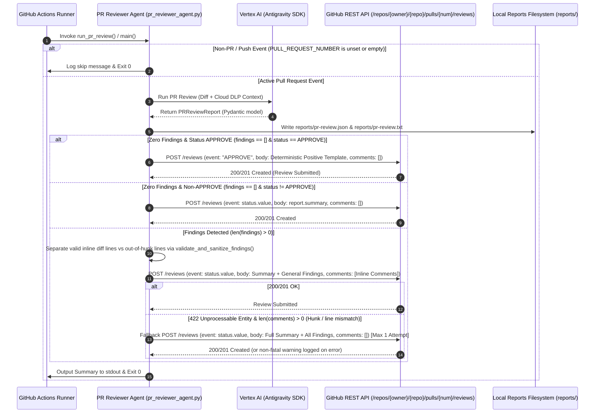

# Product Specification: Automated GitHub PR Review & Positive Comment Posting

**Status:** Approved  
**Milestone:** `pr-review-comment-posting`  
**Target Release:** `v1.0.0`  

---

## 🎯 Executive Summary
* **Goal:** Enhance `.github/scripts/pr_reviewer_agent.py` to submit formal GitHub Pull Request Reviews (`POST /repos/{owner}/{repo}/pulls/{pull_number}/reviews`), publishing positive encouraging approval comments when PRs are clean (`findings == []` and `overall_status == ReviewStatus.APPROVE`), submitting structured inline and top-level comments when code/security defects or comments are present, and handling non-PR events and API errors gracefully.
* **Target User:** Software Engineers, Security Reviewers, DevOps Engineers, and automated CI/CD pipelines.
* **Business Value:** Provides immediate, visible, encouraging, and actionable feedback directly on GitHub PRs. Speeds up pull request velocity by proactively approving clean PRs, pinpoints security and DLP defects directly on modified diff lines, and eliminates CI failure risks through resilient fallback mechanisms.

---

## 🛠️ User Stories & Workflows

### User Stories
- **Story 1 (Positive Encouragement on Clean PRs):** As a Software Engineer submitting a clean pull request with no defects or PII findings, I want the automated reviewer to post an approving GitHub PR review with a deterministic positive, encouraging message acknowledging clean diffs and zero DLP findings so that my PR is officially approved and ready for merge.
- **Story 2 (Actionable Defect & Inline Findings):** As a Developer with code or security issues in my PR, I want the automated reviewer to submit a review requesting changes (`REQUEST_CHANGES` for blockers/PII) or providing feedback (`COMMENT`), with inline comments attached to the exact modified lines and out-of-hunk issues formatted clearly in the review summary body so that I can immediately remediate issues.
- **Story 3 (Graceful Non-PR / Push Event Handling):** As a DevOps Engineer, I want push events and non-PR workflow runs to skip review submission and exit cleanly (exit code 0) without calling the GitHub Review API.
- **Story 4 (Network, Auth, and 422 Resilience):** As a CI/CD Platform Engineer, I want review submission failures (e.g. missing tokens, GitHub API rate limits, author self-review restrictions, or HTTP 422 unprocessable entity errors) to be handled gracefully with bounded fallbacks and logged as non-fatal warnings without crashing the CI workflow runner.

### Operational Workflow


---

## 📋 Acceptance Criteria

### Component: PR Reviewer Agent (`.github/scripts/pr_reviewer_agent.py`)

#### Scenario 1: Active PR with No Findings (Positive Review & Approval Comment)
- **Given** an active pull request execution where `PULL_REQUEST_NUMBER`, `GITHUB_REPOSITORY`, and `GH_TOKEN` (or `GITHUB_TOKEN`) are provided
- **And** the review evaluation produces `PRReviewReport` with `overall_status == ReviewStatus.APPROVE` and `findings == []`
- **When** `post_github_pr_review()` executes
- **Then** the agent MUST send a `POST` request to `https://api.github.com/repos/{owner}/{repo}/pulls/{pull_number}/reviews`
- **And** the request payload MUST contain:
  - `event`: `"APPROVE"`
  - `body`: Exactly matching the canonical positive approval template:
    ```markdown
    ## ✅ Automated PR Review: APPROVED

    Great job! No code defects, architectural issues, or Cloud DLP security findings were detected in this pull request. All changes look clean and ready to merge.
    ```
  - `comments`: An empty list (`[]`)
- **And** the request headers MUST include:
  - `Authorization: Bearer <token>`
  - `Accept: application/vnd.github+json`
  - `User-Agent: automated-pr-reviewer/1.0`
  - `X-GitHub-Api-Version: 2022-11-28`
- **And** all HTTP requests MUST enforce a socket connection and read timeout of 10 seconds
- **And** the agent MUST log the successful submission of the approval review
- **And** `reports/pr-review.json` and `reports/pr-review.txt` MUST be written to disk prior to review posting
- **And** the script process MUST exit with code `0`

---

#### Scenario 1b: Active PR with Zero Line Findings but Non-APPROVE Status
- **Given** an active pull request execution where `PULL_REQUEST_NUMBER`, `GITHUB_REPOSITORY`, and `GH_TOKEN` are provided
- **And** the review evaluation produces `PRReviewReport` with `findings == []` and `overall_status != ReviewStatus.APPROVE` (e.g. `REQUEST_CHANGES` or `COMMENT`)
- **When** `post_github_pr_review()` executes
- **Then** the agent MUST submit the review payload with:
  - `event`: `report.overall_status.value` (`"REQUEST_CHANGES"` or `"COMMENT"`)
  - `body`: `report.summary` (without positive approval phrasing)
  - `comments`: `[]`
- **And** the script process MUST exit with code `0`

---

#### Scenario 2: Active PR with Security or Code Defects (Structured Inline & Top-Level Comments)
- **Given** an active pull request execution where `PULL_REQUEST_NUMBER`, `GITHUB_REPOSITORY`, and `GH_TOKEN` are provided
- **And** the review evaluation produces `PRReviewReport` containing one or more `InlineFinding` items
- **And** `modified_files_diff` (`dict[str, list[int]]` mapping file paths to modified line numbers) is provided or extracted from the PR diff
- **When** `post_github_pr_review()` executes
- **Then** the agent MUST separate findings into valid inline comments and general out-of-hunk findings using `validate_and_sanitize_findings(report.findings, modified_files_diff)`
- **And** the review `event` MUST map directly from `report.overall_status.value`:
  - `"REQUEST_CHANGES"` if `overall_status == ReviewStatus.REQUEST_CHANGES` (enforced whenever any finding has `severity == PRFindingSeverity.BLOCKER` or `pii_leak == True`)
  - `"COMMENT"` if `overall_status == ReviewStatus.COMMENT`
  - `"APPROVE"` if `overall_status == ReviewStatus.APPROVE`
- **And** the agent MUST submit the review payload with:
  - `event`: `report.overall_status.value`
  - `body`: Markdown summary detailing the overall status, total finding count, and formatted descriptions of any out-of-hunk/file-level findings
  - `comments`: List of inline comment objects `[{"path": finding.file_path, "line": finding.line_number, "body": comment_body}]` for each valid inline finding
- **And** the inline comment body MUST follow the format:
  `f"**[{finding.severity.value}] {finding.title}**" + (" [PII DETECTED]" if finding.pii_leak else "") + f"\n\n{finding.details}" + (f"\n\n```suggestion\n{finding.suggestion}\n```" if finding.suggestion else "")`
- **And** the script process MUST exit with code `0`

---

#### Scenario 3: Non-PR / Push Events (Graceful Skip)
- **Given** a workflow execution where `PULL_REQUEST_NUMBER` (and CLI argument `pr_number`) is unset or empty
- **When** `run_pr_review()` and `main()` execute
- **Then** the agent MUST print `"No pull request number provided; skipping PR review."`
- **And** the agent MUST NOT make any network calls to the GitHub Review API
- **And** the agent MUST NOT invoke LLM or MCP containers
- **And** the script process MUST exit immediately with code `0`

---

#### Scenario 4: Missing or Invalid Credentials / Network Error Handling
- **Given** an active pull request where `GH_TOKEN` / `GITHUB_TOKEN` is missing, invalid (e.g. 401/403), or GitHub API encounters a network connectivity error or socket timeout
- **When** `post_github_pr_review()` executes
- **Then** the agent MUST catch the exception or HTTP error status
- **And** the agent MUST log an informative warning message describing the review submission failure (e.g. `"[Warning] Failed to post PR review to GitHub: <error_message>"`)
- **And** the agent MUST NOT crash with an unhandled exception or abort the workflow prematurely
- **And** local report artifacts `reports/pr-review.json` and `reports/pr-review.txt` MUST still be generated and written to disk
- **And** the script process MUST exit with code `0`

---

#### Scenario 5: GitHub API 422 Unprocessable Entity Handling & Bounded Fallback
- **Given** an active pull request review submission where the initial review request with inline `comments` returns HTTP status `422 Unprocessable Entity` (e.g. diff hunk mismatch or outdated commit SHA)
- **When** `post_github_pr_review()` detects HTTP `422`
- **Then** if the initial request contained `len(comments) > 0`:
  - The agent MUST log a warning indicating inline comment placement failure
  - The agent MUST immediately retry the review submission with all findings consolidated into the top-level `body` and `comments` set to `[]` (attempted at most once / max 1 retry)
  - If the fallback submission succeeds (HTTP 200/201), the agent MUST log the successful fallback review posting
  - If the fallback submission fails or returns HTTP 422, the agent MUST log the error and proceed without retrying again
- **And** if the initial request already had `comments == []` (e.g. author self-review restriction on APPROVE), the agent MUST log the warning and MUST NOT attempt redundant retries
- **And** the script process MUST exit with code `0`

---

#### Scenario 6: Local Report Artifacts Dual-Output Preservation
- **Given** any execution of `run_pr_review()` on an active PR
- **When** report generation completes
- **Then** `reports/pr-review.json` MUST be created containing valid JSON serialized from `PRReviewReport`
- **And** `reports/pr-review.txt` MUST be created containing human-readable formatted summary and findings
- **And** directory `reports/` MUST be created automatically if it does not already exist prior to writing

---

#### Scenario 7: CLI Argument & Environment Variable Priority with Repo Sanitization
- **Given** CLI arguments passed to `pr_reviewer_agent.py` (`sys.argv[1]` = pr_number, `sys.argv[2]` = repo, `sys.argv[3]` = token)
- **When** `main()` resolves configuration parameters
- **Then** non-empty CLI arguments MUST take precedence over environment variables:
  - PR Number: `sys.argv[1]` (if non-empty) > `PULL_REQUEST_NUMBER` > `PR_NUMBER`
  - Repository: `sys.argv[2]` (if non-empty) > `GITHUB_REPOSITORY` > `REPOSITORY`
  - Token: `sys.argv[3]` (if non-empty) > `GH_TOKEN` > `GITHUB_TOKEN` > `GITHUB_PERSONAL_ACCESS_TOKEN`
- **And** the repository string MUST be sanitized (strip leading/trailing whitespace, quotes, and `.git` suffix) and validated to contain exactly one `/` separating `owner` and `repo`
- **And** if repository format is invalid, the agent MUST log `"[Warning] Invalid repository format; skipping PR review submission."` and return cleanly without crashing

---

#### Scenario 8: Function Signature and Orchestration Lifecycle
- **Given** the PR reviewer agent module `.github/scripts/pr_reviewer_agent.py`
- **When** review posting is invoked
- **Then** the function MUST be declared with signature:
  `async def post_github_pr_review(report: PRReviewReport, pr_number: str | int, repo: str, token: str, modified_files_diff: dict[str, list[int]] | None = None) -> bool`
- **And** `post_github_pr_review()` MUST be called directly within `run_pr_review()` immediately after `_write_pr_reports(report)` when `pr_number`, `repo`, and `token` are resolved
- **And** synchronous network operations MUST be executed via `asyncio.to_thread` to prevent blocking the async event loop

---

## 🚨 Constraints & Architecture

1. **GitHub API Review Contract:**
   - Endpoint: `POST https://api.github.com/repos/{owner}/{repo}/pulls/{pull_number}/reviews`
   - Headers: `Authorization: Bearer <token>`, `Accept: application/vnd.github+json`, `User-Agent: automated-pr-reviewer/1.0`, `X-GitHub-Api-Version: 2022-11-28`.
   - Positive Review Content: On `APPROVE`, the body MUST strictly match the canonical template:
     `"## ✅ Automated PR Review: APPROVED\n\nGreat job! No code defects, architectural issues, or Cloud DLP security findings were detected in this pull request. All changes look clean and ready to merge."`
2. **Async HTTP & Standard Library Support:**
   - Implement review posting using `urllib.request` wrapped in `asyncio.to_thread()` or `urllib3` / `httpx`, enforcing a 10-second timeout on all requests.
3. **Pydantic Model Consistency:**
   - Rely on `PRReviewReport`, `InlineFinding`, `PRFindingSeverity`, and `ReviewStatus` data structures.
   - Enforce invariant: `BLOCKER` or `pii_leak=True` coerces `ReviewStatus.REQUEST_CHANGES`.
4. **Resilience & Bounded Non-Blocking Execution:**
   - Transient API errors, auth failures, rate limits, or 422 errors must never crash the runner or fail the CI workflow.
   - 422 fallbacks are bounded to at most 1 retry and only triggered if inline comments were present in the initial payload.
5. **Zero Source Code Pollution:**
   - All review posting logic resides strictly in `.github/scripts/pr_reviewer_agent.py` and supporting scripts in `.github/scripts/`.

---

## 📖 Decisions & Rule Matrix

| ID | Rule | Description & Rationale | Traceability Reference |
|---|---|---|---|
| **D-1** | Positive Approval Review on Clean PR | When `overall_status == ReviewStatus.APPROVE` and `findings == []`, submit a GitHub PR Review with `event: "APPROVE"` and canonical positive markdown body acknowledging clean diffs and zero DLP findings. | Scenario 1 |
| **D-2** | Direct Status-to-Event Mapping | Map the review event directly from `report.overall_status.value`: `APPROVE` -> `"APPROVE"`, `REQUEST_CHANGES` -> `"REQUEST_CHANGES"`, `COMMENT` -> `"COMMENT"`. Model validation guarantees BLOCKER/PII coerces `overall_status` to `REQUEST_CHANGES`. | Scenario 2 |
| **D-3** | Diff Hunks Sanitization & Inline Comment Placement | Pass `modified_files_diff: dict[str, list[int]]` into `validate_and_sanitize_findings()` to separate valid diff lines from out-of-hunk findings. Out-of-hunk findings are formatted in the top-level `body`. | Scenario 2 |
| **D-4** | Non-PR Graceful Skip | Exit `0` immediately when `PULL_REQUEST_NUMBER` is missing or empty without calling GitHub APIs or LLM. | Scenario 3 |
| **D-5** | Network & Credential Error Handling | Catch HTTP and connection errors during GitHub review posting with 10s timeout, log non-fatal warnings, and do not fail the CI process. | Scenario 4 |
| **D-6** | Bounded HTTP 422 Fallback | If review submission fails with HTTP 422 and `len(comments) > 0`, retry at most once with all findings in `body` and `comments: []`. If comments was already empty or retry fails, log warning and skip further retries. | Scenario 5 |
| **D-7** | Dual-Output Artifact Generation | Ensure `reports/pr-review.json` and `reports/pr-review.txt` are always written to disk before submitting the review. | Scenario 6 |
| **D-8** | Parameter Resolution Hierarchy & Sanitization | Resolve non-empty parameters (`sys.argv` > primary env var > fallback env var) and validate `owner/repo` format. | Scenario 7 |
| **D-9** | Zero-Findings Non-APPROVE Reviews | When `findings == []` but `overall_status != ReviewStatus.APPROVE`, submit with `event: overall_status.value`, `body: report.summary`, and `comments: []`. | Scenario 1b |
| **D-10** | Async Function Contract & Invocation | Define `async def post_github_pr_review(...) -> bool` called within `run_pr_review()` following artifact persistence. | Scenario 8 |

---

## 📂 Deliverables & File Layout

```
.github/scripts/
├── pr_reviewer_agent.py               # Enhanced with post_github_pr_review() and positive approval submission
└── tests/
    └── test_pr_reviewer_agent.py      # Unit & contract tests for review posting and positive feedback scenarios
plans/
├── 00-ROADMAP.md                      # Roadmap updated with active milestone
└── active_milestones/
    └── pr-review-comment-posting/
        ├── context.md                 # Context report
        ├── spec.md                    # This formal Gherkin specification
        └── adversarial-reviews/
            └── spec-validation.md     # Adversarial review report from 3-skeptic panel
```
