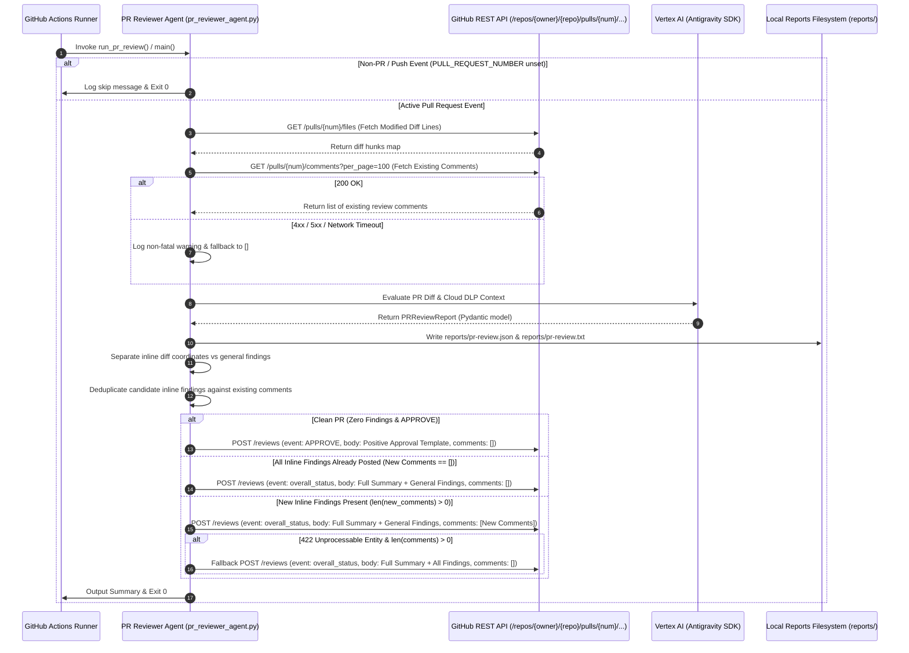

# Technical Plan: PR Reviewer Agent Comment Deduplication Across Pipeline Runs

## 🔍 Analysis & Context

*   **Objective:** Enhance the Automated PR Reviewer Agent ([`.github/scripts/pr_reviewer_agent.py`](file:///Users/yannipeng/git-projects/workshop-agentic-sdlc-lab/.github/scripts/pr_reviewer_agent.py)) to fetch existing GitHub Pull Request review comments via REST API (`GET /repos/{owner}/{repo}/pulls/{pull_number}/comments?per_page=100`), fingerprint findings to deduplicate inline comments across CI re-runs and incremental commits, publish inline comments exclusively for newly discovered issues while skipping duplicate comments, and preserve comprehensive top-level review summaries, status checks, and resilient error fallbacks.
*   **Affected Files:**
    *   `.github/scripts/pr_reviewer_agent.py` (Add `fetch_pr_comments()`, `_is_duplicate_comment()`, integrate deduplication filtering into `post_github_pr_review()`, `run_pr_review()`, and `main()`)
    *   `.github/scripts/tests/test_pr_reviewer_agent.py` (Unit and contract tests covering comment fetching, fingerprint matching, deduplication filtering, top-level body preservation, and network error fallbacks)
    *   `.github/tests/test_pr_reviewer_acceptance.py` (Acceptance tests verifying end-to-end deduplication workflows across clean PRs, initial runs, re-runs with identical findings, and incremental commits)
    *   `docs/spec.md` (Interface Contract Specification)
    *   `plans/active_milestones/pr-reviewer-comment-deduplication/plan.md` (This technical plan)
*   **Key Dependencies:**
    *   `google-antigravity` (Antigravity Python SDK: `Agent`, `LocalAgentConfig`, `types.McpStdioServer`)
    *   `pydantic>=2.0.0,<3.0.0` (`BaseModel`, `Field`, `model_validator`, `Enum`)
    *   `pytest>=8.0.0`, `pytest-asyncio` / standard library `unittest.mock` (Mocking network requests, GitHub APIs, and agent chats)
    *   Standard library `urllib.request`, `urllib.error`, `json`, `asyncio` (Synchronous HTTP requests wrapped via `asyncio.to_thread` with 10s timeout)
*   **Risks & Edge Cases:**
    1.  **Duplicate Finding Matching Collision:** Multiple distinct defects could occur on the same file and line. The fingerprint must compare `(file_path, line_number, title/severity)` to ensure distinct defects on the same line are not falsely suppressed (cites `# D-2`).
    2.  **All Inline Findings Already Posted:** When all candidate inline findings are duplicates (`len(comments) == 0`), the agent must still submit a review update with `event: report.overall_status.value` (or `COMMENT`) and top-level summary `body` so PR status checks accurately reflect open issues (cites `# D-3`, `# D-4`).
    3.  **GitHub REST API Failure / Rate Limit during Comment Fetching:** If `GET /pulls/{num}/comments` times out or fails (HTTP 4xx/5xx), the agent must log a non-fatal warning and fall back to an empty comments list (`[]`), proceeding with standard review submission without failing the CI build (cites `# D-6`).
    4.  **Original Line vs Shifted Line Matching:** GitHub review comments can store line coordinates in `line` (active diff) or `original_line` (commit diff). Fingerprint matching must check both `comment.get("line")` and `comment.get("original_line")` against `finding.line_number` (cites `# D-2`).
    5.  **Local Report Artifact Purity:** Local audit reports (`reports/pr-review.json` and `reports/pr-review.txt`) must record the complete set of discovered findings (`PRReviewReport`) regardless of inline comment deduplication (cites `# D-8`).
    6.  **Clean PR Positive Encouragement:** Clean PRs (`findings == []` & `status == APPROVE`) must continue receiving canonical positive approval feedback with `comments: []` (cites `# D-5`).
    7.  **Out-of-Hunk Finding Separation:** Out-of-hunk findings must continue routing to the top-level review body via `validate_and_sanitize_findings()` to avoid GitHub HTTP 422 errors (cites `# D-7`).

---

## 🏗️ Architecture & Operational Sequence



---

## 📋 Task Execution (Parallel Groups)

### Group 1 (Contract & Unit Test Harnesses - Parallel Execution)
- [x] **Task 1.0 (Prerequisite Interface Stubs):** Add interface stubs for `fetch_pr_comments()` and `_is_duplicate_comment()` in `.github/scripts/pr_reviewer_agent.py` raising `NotImplementedError` and update `post_github_pr_review()` / `run_pr_review()` signatures to accept `existing_comments: Optional[list[dict[str, Any]]] = None`.
- [x] **Task 1.A (Unit & Contract Tests):** Author unit and contract tests in `.github/scripts/tests/test_pr_reviewer_agent.py` covering comment fetching, pagination parameter, fingerprint duplicate matching, incremental comment filtering, all-duplicate submission, and resilient network fallbacks.
- [x] **Task 1.B (Acceptance Tests):** Author end-to-end acceptance tests in `.github/tests/test_pr_reviewer_acceptance.py` covering initial PR run, clean PR approval, re-run with duplicate comment suppression, incremental commit with new findings, and comment fetching network error resilience.

### Group 2 (Implementation in `pr_reviewer_agent.py` - Sequential Execution, Depends on Group 1)
- [x] **Task 2.A:** Implement `fetch_pr_comments()`, `_is_duplicate_comment()`, integrate deduplication into `post_github_pr_review()`, update `run_pr_review()` to fetch comments asynchronously, and ensure report artifact preservation in `.github/scripts/pr_reviewer_agent.py`.

### Group 3 (Acceptance & Integration Validation - Sequential Execution, Depends on Group 2)
- [x] **Task 3.A:** Execute the full test suite (`uv run pytest -q`) across all unit, contract, acceptance, and domain tests and verify CLI dry-run execution.

---

## 📝 Step-by-Step Implementation Details

### Group 1 (Contract & Unit Test Harnesses)

#### Task 1.0: Prerequisite Interface Stubs in `.github/scripts/pr_reviewer_agent.py`

1.  **Step 1 (Interface Stubbing):** In `.github/scripts/pr_reviewer_agent.py`, add stub signatures (cites `# D-1`, `# D-2`, `# D-3`):
    ```python
    def fetch_pr_comments(
        owner: str,
        repo_name: str,
        pr_number: Union[str, int],
        token: str,
        timeout: int = 10,
    ) -> list[dict[str, Any]]:
        """Fetches all existing pull request review comments via GitHub REST API (Decision D-1)."""
        raise NotImplementedError

    def _is_duplicate_comment(
        finding: InlineFinding,
        existing_comments: list[dict[str, Any]],
    ) -> bool:
        """Checks if candidate inline finding matches an already-posted comment (Decision D-2)."""
        raise NotImplementedError
    ```
    Update `post_github_pr_review` signature:
    ```python
    async def post_github_pr_review(
        report: PRReviewReport,
        pr_number: Union[str, int],
        repo: str,
        token: str,
        modified_files_diff: Optional[dict[str, list[int]]] = None,
        existing_comments: Optional[list[dict[str, Any]]] = None,
    ) -> bool:
        ...
    ```
    Update `run_pr_review` signature:
    ```python
    async def run_pr_review(
        pr_number: Optional[str] = None,
        repo: Optional[str] = None,
        token: Optional[str] = None,
        pii_report_path: str = "reports/pii-scan.txt",
        project_id: Optional[str] = None,
        location: str = "us-central1",
        model: Optional[str] = None,
        modified_files_diff: Optional[dict[str, list[int]]] = None,
        existing_comments: Optional[list[dict[str, Any]]] = None,
    ) -> Optional[PRReviewReport]:
        ...
    ```

2.  **Step 2 (Verification):** Verify syntax and importability:
    ```bash
    uv run python -c "from pr_reviewer_agent import fetch_pr_comments, _is_duplicate_comment; print('Deduplication stubs imported successfully')"
    ```

---

#### Task 1.A: Unit & Contract Tests in `.github/scripts/tests/test_pr_reviewer_agent.py`

1.  **Step 1 (The Unit Test Harness):** Author comprehensive unit and contract tests in `.github/scripts/tests/test_pr_reviewer_agent.py` covering:
    *   **Comment Fetching (`fetch_pr_comments`) Tests (Decision D-1, D-6):**
        *   `test_fetch_pr_comments_empty_token_returns_empty_list`:
            *   Input: `fetch_pr_comments("owner", "repo", 42, "")` and `fetch_pr_comments("owner", "repo", 42, "   ")`.
            *   Asserts returns empty list `[]` without making any network calls (cites `# D-1`).
        *   `test_fetch_pr_comments_success_parses_comments`:
            *   Mock `urllib.request.urlopen` returning JSON list of comment objects (`[{"id": 1, "path": "scorer/usage.py", "line": 20, "original_line": 20, "body": "**[BLOCKER] Division by zero**\n\nFix"}]`).
            *   Asserts request URL is `https://api.github.com/repos/owner/repo/pulls/42/comments?per_page=100`.
            *   Asserts headers include `Authorization: Bearer mock-token`, `Accept: application/vnd.github+json`, `User-Agent: automated-pr-reviewer/1.0`, `X-GitHub-Api-Version: 2022-11-28`.
            *   Asserts returns parsed list of dictionaries with length 1 (cites `# D-1`).
        *   `test_fetch_pr_comments_network_error_fallback_empty_list`:
            *   Mock `urlopen` raising `urllib.error.URLError("Connection refused")` or `HTTPError(..., 500, "Internal Server Error", ..., ...)`.
            *   Asserts warning `"[Warning] Could not fetch existing PR comments from GitHub API"` is logged.
            *   Asserts function returns `[]` without raising an exception (cites `# D-6`).
    *   **Fingerprint & Duplicate Matching (`_is_duplicate_comment`) Tests (Decision D-2):**
        *   `test_is_duplicate_comment_exact_match`:
            *   Finding: `file_path="scorer/usage.py"`, `line_number=20`, `severity=PRFindingSeverity.BLOCKER`, `title="Division by zero"`.
            *   Comment: `{"path": "scorer/usage.py", "line": 20, "body": "**[BLOCKER] Division by zero**\n\nDetails..."}`.
            *   Asserts returns `True` (cites `# D-2`).
        *   `test_is_duplicate_comment_original_line_match`:
            *   Finding: `file_path="scorer/usage.py"`, `line_number=20`, `title="Division by zero"`.
            *   Comment: `{"path": "scorer/usage.py", "line": None, "original_line": 20, "body": "**[BLOCKER] Division by zero**"}`.
            *   Asserts returns `True` (cites `# D-2`).
        *   `test_is_duplicate_comment_different_line_or_path_returns_false`:
            *   Comment on `path="scorer/other.py"` or `line=99` returns `False` (cites `# D-2`).
        *   `test_is_duplicate_comment_different_title_on_same_line_returns_false`:
            *   Comment on same line but different title (e.g. `"[WARNING] Unused import"`) returns `False` (cites `# D-2`).
        *   `test_is_duplicate_comment_case_and_whitespace_insensitivity`:
            *   Comment body with extra whitespace or markdown tags still matches finding title (cites `# D-2`).
    *   **Deduplicated Review Submission (`post_github_pr_review`) Tests (Decisions D-3, D-4, D-5):**
        *   `test_post_github_pr_review_skips_duplicate_inline_comments`:
            *   Report has Finding 1 (`scorer/usage.py:20`) and Finding 2 (`scorer/usage.py:40`).
            *   `existing_comments` contains Finding 1.
            *   `modified_files_diff={"scorer/usage.py": [20, 40]}`.
            *   Asserts review payload `comments` list has length 1 (only Finding 2).
            *   Asserts top-level review `body` details both findings and full status (cites `# D-3`, `# D-4`).
        *   `test_post_github_pr_review_all_duplicates_submits_empty_comments_with_full_summary`:
            *   Report has Finding 1 (`scorer/usage.py:20`).
            *   `existing_comments` contains Finding 1.
            *   Asserts review payload has `comments: []`.
            *   Asserts review payload has `event: "COMMENT"` (or `report.overall_status.value`).
            *   Asserts review payload `body` contains full review summary and finding details (cites `# D-3`, `# D-4`).
        *   `test_post_github_pr_review_auto_fetches_comments_if_omitted`:
            *   When `existing_comments=None`, `post_github_pr_review` calls `fetch_pr_comments()` internally and deduplicates (cites `# D-1`, `# D-3`).
    *   *Target File:* `.github/scripts/tests/test_pr_reviewer_agent.py`

2.  **Step 2 (The Verification):**
    *   Run `uv run pytest .github/scripts/tests/test_pr_reviewer_agent.py -v`. (Verify contract assertions fail with `NotImplementedError` or assertion errors during TDD Red phase).

---

#### Task 1.B: Acceptance Tests in `.github/tests/test_pr_reviewer_acceptance.py`

1.  **Step 1 (The Acceptance Test Harness):** Author end-to-end acceptance tests in `.github/tests/test_pr_reviewer_acceptance.py` covering:
    *   `test_acceptance_initial_run_with_findings_posts_all_comments`:
        *   Given an active PR where `fetch_pr_comments` returns `[]`, verifies all valid candidate inline findings are submitted in `comments` array with full status and summary (cites `# D-1`, `# D-3`, Scenario 1).
    *   `test_acceptance_clean_pr_posts_positive_approval`:
        *   Given a clean PR with zero findings, verifies positive approval review is submitted with `comments: []` and canonical `POSITIVE_APPROVAL_TEMPLATE` (cites `# D-5`, Scenario 2).
    *   `test_acceptance_rerun_all_duplicates_skips_inline_comments`:
        *   Given a re-run where all findings match existing comments, verifies review is submitted with `comments: []`, `event: "COMMENT"` (or `REQUEST_CHANGES`), and full body summary (cites `# D-3`, `# D-4`, Scenario 3).
    *   `test_acceptance_incremental_commit_posts_only_new_finding`:
        *   Given a subsequent commit where Finding A is already commented and Finding B is new, verifies review payload `comments` contains exactly Finding B while top-level body contains full summary (cites `# D-3`, `# D-4`, Scenario 4).
    *   `test_acceptance_comment_fetch_network_error_falls_back_gracefully`:
        *   Given `fetch_pr_comments` encountering network timeout or HTTP 500, verifies non-fatal warning is logged, fallback to `[]` occurs, review is submitted, and runner exits 0 (cites `# D-6`, Scenario 6).
    *   *Target File:* `.github/tests/test_pr_reviewer_acceptance.py`

2.  **Step 2 (The Verification):**
    *   Run `uv run pytest .github/tests/test_pr_reviewer_acceptance.py -v`. (Verify expected TDD failure on unimplemented methods).

---

### Group 2 (Implementation in `pr_reviewer_agent.py`)

#### Task 2.A: Implement Comment Fetching, Deduplication Matching, and Integrated Flow in `pr_reviewer_agent.py`

1.  **Step 1 (The Implementation):** In `.github/scripts/pr_reviewer_agent.py`:
    *   Implement `fetch_pr_comments()`:
        ```python
        def fetch_pr_comments(
            owner: str,
            repo_name: str,
            pr_number: Union[str, int],
            token: str,
            timeout: int = 10,
        ) -> list[dict[str, Any]]:
            """Fetches all existing pull request review comments via GitHub REST API (Decision D-1, D-6)."""
            import urllib.request
            import urllib.error

            if not token or not token.strip():
                return []

            url = f"https://api.github.com/repos/{owner}/{repo_name}/pulls/{pr_number}/comments?per_page=100"
            req = urllib.request.Request(
                url=url,
                method="GET",
                headers={
                    "Authorization": f"Bearer {token}",
                    "Accept": "application/vnd.github+json",
                    "User-Agent": "automated-pr-reviewer/1.0",
                    "X-GitHub-Api-Version": "2022-11-28",
                },
            )
            try:
                with urllib.request.urlopen(req, timeout=timeout) as resp:
                    data = json.loads(resp.read().decode("utf-8"))
                    if isinstance(data, list):
                        return data
                    return []
            except Exception as e:
                print(f"[Warning] Could not fetch existing PR comments from GitHub API: {e}", flush=True)
                return []
        ```
    *   Implement `_is_duplicate_comment()`:
        ```python
        def _is_duplicate_comment(
            finding: InlineFinding,
            existing_comments: list[dict[str, Any]],
        ) -> bool:
            """Checks if candidate inline finding matches an already-posted comment (Decision D-2)."""
            if not existing_comments or finding.line_number is None:
                return False

            for comment in existing_comments:
                c_path = comment.get("path")
                if c_path != finding.file_path:
                    continue

                c_line = comment.get("line")
                c_orig_line = comment.get("original_line")
                line_matches = (c_line == finding.line_number) or (c_orig_line == finding.line_number)
                if not line_matches:
                    continue

                c_body = (comment.get("body") or "").strip()
                title_clean = finding.title.strip().lower()
                sev_tag = f"[{finding.severity.value}]".lower()
                if title_clean in c_body.lower() or (sev_tag in c_body.lower() and title_clean[:20] in c_body.lower()):
                    return True

            return False
        ```
    *   Update `post_github_pr_review()`:
        *   Accept `existing_comments: Optional[list[dict[str, Any]]] = None`.
        *   If `existing_comments is None` and valid `token` / `owner` / `repo_name` / `pr_number` present:
            ```python
            if existing_comments is None:
                existing_comments = fetch_pr_comments(owner, repo_name, pr_number, token)
            ```
        *   Filter candidate inline findings:
            ```python
            new_inline_comments: list[dict[str, Any]] = []
            duplicate_count = 0
            for finding in inline_findings:
                if _is_duplicate_comment(finding, existing_comments or []):
                    duplicate_count += 1
                else:
                    if finding.line_number is not None:
                        comment_body = (
                            f"**[{finding.severity.value}] {finding.title}**"
                            + (" [PII DETECTED]" if finding.pii_leak else "")
                            + f"\n\n{finding.details}"
                        )
                        if finding.suggestion:
                            comment_body += f"\n\n```suggestion\n{finding.suggestion}\n```"
                        new_inline_comments.append({
                            "path": finding.file_path,
                            "line": finding.line_number,
                            "body": comment_body,
                        })
            if duplicate_count > 0:
                print(f"[Notice] Skipped {duplicate_count} duplicate inline review comment(s) already posted on PR.")
            ```
        *   Set `comments = new_inline_comments`.
    *   Update `run_pr_review()`:
        *   Fetch both `modified_files_diff` and `existing_comments` asynchronously:
            ```python
            if existing_comments is None and pr_number and repo and token:
                repo_parsed = _sanitize_and_validate_repo(repo)
                if repo_parsed:
                    owner, repo_name = repo_parsed
                    existing_comments = await asyncio.to_thread(
                        fetch_pr_comments, owner, repo_name, pr_number, token
                    )
            ```
        *   Pass `existing_comments` to `post_github_pr_review()`.
        *   Preserve `_write_pr_reports(report)` writing unmutated report to `reports/pr-review.json` and `reports/pr-review.txt`.
    *   *Target File:* `.github/scripts/pr_reviewer_agent.py`

2.  **Step 2 (The Verification):**
    *   Run `uv run pytest .github/scripts/tests/test_pr_reviewer_agent.py -v`.
    *   Run `uv run pytest .github/tests/test_pr_reviewer_acceptance.py -v`.

---

### Group 3 (Acceptance & Integration Validation)

#### Task 3.A: Full Test Suite Execution & Integration Validation

1.  **Step 1 (Run All Unit & Acceptance Tests):**
    *   Execute full test suite across both `scorer/` domain and `.github/` test suites:
        ```bash
        uv run pytest -v
        ```
2.  **Step 2 (CLI Execution Dry-Run Verification):**
    *   Verify CLI dry-run on non-PR event exits cleanly with 0:
        ```bash
        uv run python .github/scripts/pr_reviewer_agent.py
        ```
3.  **Step 3 (Success Verification):**
    *   Ensure all test assertions pass with 0 failures and 0 errors.

---

## 🧪 Global Testing Strategy

*   **Unit & Contract Tests (`.github/scripts/tests/test_pr_reviewer_agent.py`):**
    *   Comment fetching query structure, query parameters (`per_page=100`), authorization header, and empty token handling.
    *   Non-fatal comment fetch network error / timeout fallback returning `[]`.
    *   Finding fingerprint duplicate matching across exact line, `original_line`, case-insensitivity, and distinct defect separation.
    *   Incremental inline comment submission filtering (`new_inline_comments`).
    *   All-duplicate inline findings submission with `comments: []` and full summary body preservation.
    *   Clean PR positive encouragement approval submission.
*   **Acceptance Tests (`.github/tests/test_pr_reviewer_acceptance.py`):**
    *   End-to-end simulation of PR review lifecycle across initial run, clean PR approval, re-runs with duplicate comment suppression, incremental commits with new findings, and comment fetching network errors.
*   **Core Scorer Regression Tests (`scorer/tests/`):**
    *   Verify zero regressions across `test_starter.py`, `test_parse_contract.py`, `test_score_contract.py`, and `test_integration.py`.
*   **Test Commands:**
    ```bash
    uv run pytest .github/scripts/tests/test_pr_reviewer_agent.py -v
    uv run pytest .github/tests/test_pr_reviewer_acceptance.py -v
    uv run pytest -q
    ```

---

## 🗺️ Traceability Matrix (Decisions & Acceptance Criteria)

| Spec Decision ID | Spec Scenario | Technical Plan Task | Verification / Test Assertion in `.github/scripts/tests/` & `.github/tests/` |
|---|---|---|---|
| **D-1** (Prior Comment Query via REST API) | Scenario 1, Scenario 3 | Task 1.A, 1.B, 2.A | `test_fetch_pr_comments_success_parses_comments`, `test_acceptance_initial_run_with_findings_posts_all_comments` |
| **D-2** (Deterministic Finding Fingerprint) | Scenario 3, Scenario 8 | Task 1.A, 1.B, 2.A | `test_is_duplicate_comment_exact_match`, `test_is_duplicate_comment_original_line_match`, `test_is_duplicate_comment_different_title_on_same_line_returns_false` |
| **D-3** (Incremental Inline Posting) | Scenario 3, Scenario 4 | Task 1.A, 1.B, 2.A | `test_post_github_pr_review_skips_duplicate_inline_comments`, `test_acceptance_incremental_commit_posts_only_new_finding` |
| **D-4** (Top-Level Summary Fidelity) | Scenario 3, Scenario 4 | Task 1.A, 1.B, 2.A | `test_post_github_pr_review_all_duplicates_submits_empty_comments_with_full_summary`, `test_acceptance_rerun_all_duplicates_skips_inline_comments` |
| **D-5** (Clean PR Positive Approval) | Scenario 2, Scenario 5 | Task 1.A, 1.B, 2.A | `test_post_github_pr_review_positive_approval_clean_pr`, `test_acceptance_clean_pr_posts_positive_approval` |
| **D-6** (Resilient API Fallback) | Scenario 6 | Task 1.A, 1.B, 2.A | `test_fetch_pr_comments_network_error_fallback_empty_list`, `test_acceptance_comment_fetch_network_error_falls_back_gracefully` |
| **D-7** (Out-of-Hunk Line Separation) | Scenario 7 | Task 1.A, 2.A | `test_validate_and_sanitize_findings_separates_inline_and_general` |
| **D-8** (Report Artifact Purity) | Scenario 3, Constraints | Task 1.A, 2.A | `test_run_pr_review_writes_artifacts_before_posting` |

---

## 🎯 Success Criteria

1.  **Strict Planning Separation:** No source code in `.github/scripts/pr_reviewer_agent.py` is modified during this planning phase.
2.  **Complete Machine-Readable Plan:** `plans/active_milestones/pr-reviewer-comment-deduplication/plan.md` defines clear execution groups, dependencies, exact test assertions, and step-by-step logic.
3.  **100% Traceability:** Every decision (`D-1` through `D-8`) and scenario (`Scenario 1` through `Scenario 8`) from `spec.md` is explicitly covered in task definitions and the traceability matrix.
4.  **Parallel Execution Readiness:** Group 1 test harness tasks (Task 1.A and Task 1.B) are decoupled for parallel authoring by engineer subagents.
5.  **Passing Test Suite:** Execution of `uv run pytest -q` passes completely once Phase 4 implementation concludes.
