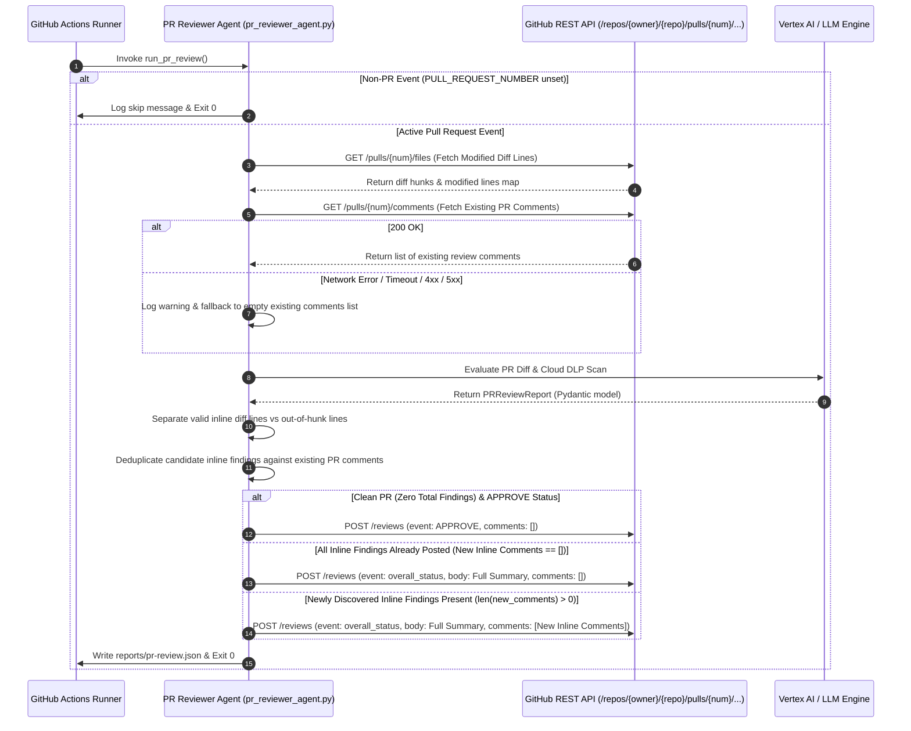

# Product Specification: PR Reviewer Agent Comment Deduplication Across Pipeline Runs

**Status:** Approved  
**Milestone:** `pr-reviewer-comment-deduplication`  
**Target Release:** `v1.0.0`  
**Jira Ticket:** `OPS-16`  

---

## 🎯 Executive Summary
*   **Goal:** Enhance `.github/scripts/pr_reviewer_agent.py` to query existing GitHub PR review comments prior to submission, deduplicating inline comments so that re-runs and incremental commits on the same pull request only publish newly introduced findings while skipping identical existing comments and preserving overall review status and summary.
*   **Target User:** Software Engineers, Security Reviewers, Platform/DevOps Engineers, and Automated CI/CD Pipelines.
*   **Business Value:** Eliminates noise and notification spam caused by repeated inline comments across PR commit pushes and CI re-runs, keeps PR review threads clean and focused on newly discovered issues, and accelerates review turnarounds while ensuring 100% CI pipeline reliability through resilient fallback behavior.

---

## 🛠️ User Stories & Workflows

### User Stories
- **Story 1 (Deduplication on Re-runs & Re-commits):** As a Software Developer pushing subsequent commits or triggering CI re-runs on an existing pull request, I want the PR Reviewer Agent to recognize inline findings that have already been posted in earlier runs and skip posting duplicate comments on the same file paths and lines so that my PR discussion thread remains clean and readable.
- **Story 2 (Incremental New Findings Notification):** As a Developer pushing changes that introduce new defects alongside existing unresolved issues, I want the agent to post inline comments *only* for the newly introduced findings while continuing to reflect the comprehensive review status (`REQUEST_CHANGES` or `COMMENT`) and summary for all open findings.
- **Story 3 (Clean / Approved PRs):** As a Developer with a clean pull request (zero findings), I want the reviewer to submit an approving review (`APPROVE`) with standard positive feedback regardless of prior runs.
- **Story 4 (Resolved Finding Cleanup):** As a Developer who resolves a previously flagged issue in a subsequent commit, I want the agent to omit the resolved finding from new comment submissions without re-posting outdated comments.
- **Story 5 (API Error Resilience & Graceful Degradation):** As a CI/CD Platform Engineer, I want the comment deduplication logic to handle GitHub API failures, rate limits, or network timeouts gracefully by falling back to standard review posting and logging a non-fatal warning without crashing the CI workflow.

### Operational Sequence Workflow


---

## 📋 Acceptance Criteria

### Component: PR Reviewer Agent (`.github/scripts/pr_reviewer_agent.py`)

#### Scenario 1: Initial PR Run with Findings (All New Inline Comments Posted)
- **Given** an active pull request with PR number, repository, and valid GitHub token
- **And** the PR review evaluation generates candidate findings on modified diff lines
- **And** no existing review comments have been posted on the PR (`GET /pulls/{num}/comments` returns empty `[]`)
- **When** `post_github_pr_review()` executes
- **Then** the agent MUST post all candidate valid inline findings as inline review comments in the `POST /reviews` payload
- **And** the review `event` MUST match the report `overall_status.value` (`REQUEST_CHANGES` or `COMMENT`)
- **And** the top-level review body MUST contain the review summary and general findings

---

#### Scenario 2: Clean PR with No Findings (Positive Review Approval)
- **Given** an active pull request execution with valid credentials
- **And** the review evaluation produces `PRReviewReport` with `overall_status == ReviewStatus.APPROVE` and `findings == []`
- **When** `post_github_pr_review()` executes
- **Then** the agent MUST submit a GitHub PR review with:
  - `event`: `"APPROVE"`
  - `body`: Canonical positive approval template acknowledging clean diffs and zero DLP findings
  - `comments`: Empty list `[]`
- **And** the script process MUST exit cleanly with code `0`

---

#### Scenario 3: PR Re-run / Subsequent Commit with Identical Findings (Inline Duplicate Comments Skipped)
- **Given** an active pull request where existing review comments have already been posted on earlier runs
- **And** the current evaluation discovers findings identical in `file_path`, `line_number`, and core issue title/signature to the already-posted comments
- **When** candidate findings are filtered for deduplication
- **Then** the agent MUST identify all candidate inline findings as duplicate comments
- **And** the agent MUST NOT submit duplicate inline comments in the review `comments` payload (`comments: []`)
- **And** the agent MUST still submit the review with `event: report.overall_status.value` and the complete `body` summary reflecting all active issues
- **And** the agent MUST log that duplicate inline comments were skipped

---

#### Scenario 4: Subsequent Commit with New Findings Alongside Existing Findings (Incremental Comment Posting)
- **Given** an active pull request where Finding A on `file1.py:10` was previously commented
- **And** a new commit introduces Finding B on `file2.py:25` while Finding A remains present
- **When** `post_github_pr_review()` executes
- **Then** the agent MUST filter out Finding A as a duplicate
- **And** the agent MUST include Finding B in the review `comments` payload
- **And** the review `body` summary MUST reflect the full overall status and include summary context for all open findings
- **And** the review request MUST submit exactly one inline comment for Finding B

---

#### Scenario 5: Subsequent Commit with Resolved Findings (No Obsolete Comments Posted)
- **Given** a pull request where an earlier finding on `file1.py:10` has been fixed and removed in the latest commit
- **And** the review evaluation only finds clean code or new findings unrelated to `file1.py:10`
- **When** `post_github_pr_review()` executes
- **Then** the agent MUST NOT generate or post comments for the resolved finding on `file1.py:10`
- **And** if all findings are resolved and the PR is now clean, the agent MUST submit an `"APPROVE"` review with positive feedback

---

#### Scenario 6: GitHub Comment Fetching Error / Network Timeout (Graceful Degradation)
- **Given** an active pull request execution where `GET /pulls/{num}/comments` fails (e.g. HTTP 403/404/500, network connection timeout, or invalid response)
- **When** the comment retrieval helper executes
- **Then** the agent MUST catch the exception or HTTP error
- **And** the agent MUST log an informative non-fatal warning (e.g. `"[Warning] Could not fetch existing PR comments: <reason>"`)
- **And** the agent MUST gracefully fall back to an empty existing comments collection (`[]`)
- **And** the agent MUST proceed with standard review posting without crashing or failing the CI runner
- **And** the script process MUST exit cleanly with code `0`

---

#### Scenario 7: Out-of-Hunk Findings Handling in Deduplicated Workflows
- **Given** candidate findings where some line numbers fall outside modified diff hunks
- **When** findings are sanitized and deduplicated
- **Then** out-of-hunk findings MUST NOT be posted as inline diff comments (avoiding GitHub HTTP 422 errors)
- **And** out-of-hunk findings MUST be formatted in the top-level review `body`
- **And** out-of-hunk findings MUST NOT trigger duplicate inline comment creation

---

#### Scenario 8: Deduplication Signature & Matching Strategy
- **Given** existing GitHub PR review comments returned from the API
- **When** candidate `InlineFinding` objects are compared against existing comments
- **Then** an existing comment MUST be considered a duplicate match if:
  1. The existing comment's `path` matches `finding.file_path`
  2. The existing comment's `line` (or `original_line`) matches `finding.line_number`
  3. The existing comment's `body` contains the finding's sanitized title or severity tag (e.g. `f"[{finding.severity.value}] {finding.title}"`)
- **And** whitespace differences or markdown formatting variations MUST NOT prevent duplicate detection

---

## 🚨 Constraints & Edge Cases

1. **GitHub REST API Endpoint Specifications:**
   - Fetching Comments: `GET https://api.github.com/repos/{owner}/{repo}/pulls/{pull_number}/comments?per_page=100`
   - Submitting Reviews: `POST https://api.github.com/repos/{owner}/{repo}/pulls/{pull_number}/reviews`
   - Issue Comments Fallback: `POST https://api.github.com/repos/{owner}/{repo}/issues/{pull_number}/comments`
2. **Network Timeout & Pagination Constraints:**
   - All HTTP GET and POST requests MUST enforce a connection and read timeout of 10 seconds.
   - Fetching comments should support pagination up to 100 comments per page to prevent truncation on busy PRs.
3. **Pydantic Model Integrity:**
   - All deduplication logic must preserve the `PRReviewReport`, `InlineFinding`, `PRFindingSeverity`, and `ReviewStatus` schemas.
   - Deduplication must NOT mutate the underlying `report.findings` or `report.overall_status` objects in memory before writing the local `reports/pr-review.json` artifact (the artifact must represent the complete audit findings).
4. **Idempotence & Review Submission:**
   - When all candidate findings are duplicates (`new_comments == []`), the agent still submits a top-level review update with `comments: []` and the appropriate `overall_status` (e.g. `REQUEST_CHANGES` or `COMMENT`) so PR status checks accurately reflect open issues.
5. **Zero Source Code Invasiveness:**
   - Code changes remain strictly confined to `.github/scripts/pr_reviewer_agent.py` and its test suite in `.github/scripts/tests/`.

---

## 🎨 UI/UX & Output Mockups

### 1. New Finding Inline Comment Format
```markdown
**[BLOCKER] Hardcoded API Token Detected** [PII DETECTED]

Cloud DLP identified an unredacted API key in the newly committed changes. Move this credential to Google Secret Manager.

```suggestion
token = os.environ.get("SERVICE_API_KEY")
```
```

### 2. PR Review Top-Level Body Summary (Deduplicated State)
```markdown
### Status: REQUEST_CHANGES
Summary: 2 blocking security findings and 1 suggestion detected. Note: 2 existing inline findings were previously commented and remain open.

### General & Out-of-Hunk Findings:
1. [WARNING] src/config.py - Missing timeout on outbound client
   Details: Outbound HTTP connection has no explicit socket timeout configured.
   Suggestion: timeout=10
```

---

## 📖 Decisions & Rule Matrix

| ID | Rule | Description & Rationale | Traceability Reference |
|---|---|---|---|
| **D-1** | Prior Comment Query via REST API | Fetch existing PR review comments via `GET /repos/{owner}/{repo}/pulls/{pull_number}/comments?per_page=100` prior to constructing review payload. | Scenario 1, Scenario 3 |
| **D-2** | Deterministic Finding Fingerprint | Match comments on `(path, line, title/severity)` to accurately detect duplicates without false positives across distinct findings on the same line. | Scenario 3, Scenario 8 |
| **D-3** | Incremental Inline Posting | Only include non-duplicate findings in the review `comments: [...]` array. Omit previously commented inline findings. | Scenario 3, Scenario 4 |
| **D-4** | Top-Level Summary Fidelity | Preserve full findings count and status in `report.summary` and top-level review `body` even when inline comments are deduplicated. | Scenario 3, Scenario 4 |
| **D-5** | Clean PR Positive Approval | Clean PRs (`findings == []` & `status == APPROVE`) always receive canonical positive review approval. | Scenario 2, Scenario 5 |
| **D-6** | Resilient API Fallback | If comment fetching encounters network errors, timeouts, or non-200 responses, log warning and fallback to empty list without failing CI. | Scenario 6 |
| **D-7** | Out-of-Hunk Line Separation | Continue routing out-of-hunk findings to top-level review body to prevent GitHub HTTP 422 errors. | Scenario 7 |
| **D-8** | Report Artifact Purity | `reports/pr-review.json` and `reports/pr-review.txt` must record the complete set of discovered findings regardless of inline comment deduplication. | Scenario 3, Constraints |

---

## 📂 Deliverables & File Layout

```
plans/
├── 00-ROADMAP.md                                                # Master Roadmap updated with active milestone
└── active_milestones/
    └── pr-reviewer-comment-deduplication/
        ├── context.md                                           # Phase 0 Context Report
        └── spec.md                                              # This formal Gherkin Specification
.github/scripts/
├── pr_reviewer_agent.py                                         # Enhanced with fetch_pr_comments() & deduplication logic
└── tests/
    └── test_pr_reviewer_agent.py                                # Acceptance & unit tests covering all deduplication scenarios
```
