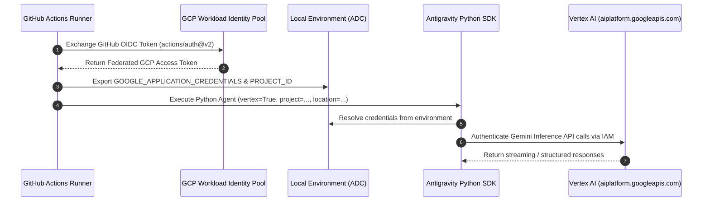

# Migration Plan: Migrating CI/CD Quality Gate & Review from `agy` CLI to Antigravity Python SDK

## 1. Executive Summary & Objectives

This document details the migration plan to transform the existing GitHub Actions workflow ([`.github/workflows/source-code-pii-review.yml`](file:///Users/yannipeng/git-projects/workshop-agentic-sdlc-lab/.github/workflows/source-code-pii-review.yml)) from the standalone `agy` CLI to the **Google Antigravity Python SDK** (`google-antigravity`).

### Core Objectives
1. **Keyless GCP Vertex AI Authentication**: Eliminate `GEMINI_API_KEY` by leveraging GitHub Actions Workload Identity Federation (WIF) and Google Cloud **Application Default Credentials (ADC)** in Vertex AI Standard Mode.
2. **Deterministic Pydantic Type Safety**: Replace brittle bash/grep output parsing (`grep -q "GATE_FAILED"`) with native **Pydantic models** (`response_schema` and `response.structured_output()`) to guarantee zero-ambiguity parsing in CI gates.
3. **Structured PR Review Comments**: Extract line-level review comments and PII remediation notices into structured models for programmatic posting.
4. **Deterministic CI Execution**: Eliminate CLI shell installation overhead (`curl | bash`), file system symlink wrangling, and ad-hoc settings JSON templating in favor of standard Python dependency management.
5. **Programmatic Telemetry & Artifacts**: Manage session transcripts, audit logs, and reports cleanly using `app_data_dir` configuration.

---

## 2. Authentication Architecture: WIF + Vertex AI ADC

The pipeline authenticates to Google Cloud via Workload Identity Federation (WIF) using `google-github-actions/auth@v2`. This sets the `GOOGLE_APPLICATION_CREDENTIALS` environment variable pointing to the temporary OIDC federated credential file.



### SDK Configuration Specification

In the Google Antigravity SDK, Standard Mode (Vertex AI with ADC) is activated by passing `vertex=True` alongside the target GCP `project` and `location` in [`LocalAgentConfig`](file:///Users/yannipeng/.gemini/config/plugins/google-antigravity-sdk/skills/google-antigravity-sdk/references/agent_configuration.md#L132-L136):

```python
import os
from google.antigravity import LocalAgentConfig

config = LocalAgentConfig(
    vertex=True,
    project=os.environ.get("GOOGLE_CLOUD_PROJECT"),
    location=os.environ.get("GOOGLE_CLOUD_LOCATION", "us-central1"),
    model="gemini-3.7-flash",
    app_data_dir=os.path.abspath("reports/agent_data"),
)
```

No API keys are required or stored in repository secrets.

---

## 3. Workflow Comparison & Delta

### High-Level Architectural Comparison

| Dimension | Current Architecture (`agy` CLI) | Proposed Architecture (Python SDK + Pydantic) | Critical Impact |
| :--- | :--- | :--- | :--- |
| **Output Type Safety** | Freeform streamed text / raw terminal logs. Requires bash regex/grep string matching. | Native **Pydantic models** (`response_schema`). Deterministic JSON parsing. | **Critical**: Eliminates parsing ambiguity and false positives/negatives in CI gates. |
| **Auth Mechanism** | `GEMINI_API_KEY` secret or CLI settings. | Native GCP ADC via WIF (`vertex=True`). | **Critical**: Keyless IAM-governed access. |
| **Tool Installation** | `curl -fsSL https://antigravity.google/cli/install.sh \| bash` | Standard Python dependency (`pip install google-antigravity pydantic`). | **High**: Fast, reproducible CI runner setup. |
| **Quality Gate Evaluation** | Raw prompt string piped to `tee`, parsed with `grep "GATE_FAILED"`. | Pydantic response schema (`response_schema=QualityGateDecision`). | **Critical**: Guaranteed boolean gate decision with structured failure breakdown. |
| **Gate Result Storage** | Text file `reports/decision.txt`. | Strongly typed JSON `reports/gate-decision.json`. | **High**: Standardized schema for dashboards and GCS archives. |
| **GitHub PR Review Integration** | Docker-based GitHub MCP server configured via `.agents/mcp_config.json`. | Native MCP Stdio transport (`types.McpStdioServer`) with structured schema output. | **High**: Automated inline PR comments with file and line precision. |

---

## 4. Pydantic Domain Models & Implementation

### Step 1: Quality Gate Agent Script (`.github/scripts/quality_gate_agent.py`)

This script reads the DLP scan report and PR code review, queries Vertex AI with strict Pydantic schema validation, and saves structured JSON.

```python
"""Quality Gate Decision Agent using Antigravity Python SDK with Vertex AI ADC and Pydantic."""

import asyncio
import json
import os
import sys
from enum import Enum
from pydantic import BaseModel, Field
from google.antigravity import Agent, LocalAgentConfig


class SeverityLevel(str, Enum):
    CRITICAL = "CRITICAL"
    HIGH = "HIGH"
    MEDIUM = "MEDIUM"
    LOW = "LOW"


class ViolationCategory(str, Enum):
    PII_LEAK = "PII_LEAK"
    CREDENTIAL_LEAK = "CREDENTIAL_LEAK"
    SECURITY_VULNERABILITY = "SECURITY_VULNERABILITY"
    ARCHITECTURAL_DEFECT = "ARCHITECTURAL_DEFECT"


class FailureDetail(BaseModel):
    category: ViolationCategory = Field(description="Type of violation detected")
    component: str = Field(description="Impacted file, service, or pipeline step")
    severity: SeverityLevel = Field(description="Severity classification")
    reason: str = Field(description="Detailed explanation of the failure")
    remediation: str = Field(description="Actionable steps required to resolve the failure")


class QualityGateDecision(BaseModel):
    passed: bool = Field(description="Strictly True if ALL quality & security criteria pass; False if ANY violation exists")
    summary: str = Field(description="Executive summary of the quality evaluation")
    failures: list[FailureDetail] = Field(default_factory=list, description="List of failing criteria if passed is False")


async def evaluate_quality_gate() -> int:
    # 1. Read input audit reports
    dlp_path = "reports/pii-scan.txt"
    pr_review_path = "reports/pr-review.txt"

    dlp_content = open(dlp_path, "r", encoding="utf-8").read() if os.path.exists(dlp_path) else "No DLP scan report available."
    pr_review_content = open(pr_review_path, "r", encoding="utf-8").read() if os.path.exists(pr_review_path) else "No PR review report available (push event or non-PR)."

    combined_report = f"""
========================================================
### 1. CLOUD DLP PII SCAN REPORT
========================================================
{dlp_content}

========================================================
### 2. PR CODE REVIEW REPORT
========================================================
{pr_review_content}
"""

    # 2. Configure SDK with Vertex AI ADC and Pydantic response schema
    project_id = os.environ.get("GOOGLE_CLOUD_PROJECT")
    location = os.environ.get("GOOGLE_CLOUD_LOCATION", "us-central1")
    os.makedirs("reports/telemetry", exist_ok=True)

    config = LocalAgentConfig(
        vertex=True,
        project=project_id,
        location=location,
        model="gemini-3.7-flash",
        system_instructions=(
            "You are a Lead Release Engineer and Security Gatekeeper. "
            "Evaluate combined DLP and PR code review reports against release criteria.\n"
            "Quality Gate Criteria:\n"
            "1. ZERO PII, credential, or authentication token leaks detected by Cloud DLP.\n"
            "2. PR Code Review contains no unresolved blocking architectural or critical security failures."
        ),
        response_schema=QualityGateDecision,
        app_data_dir=os.path.abspath("reports/telemetry/quality_gate_agent"),
    )

    prompt = f"Evaluate the following combined security and code review report against our quality gate criteria:\n\n{combined_report}"

    async with Agent(config) as agent:
        response = await agent.chat(prompt)
        raw_output = await response.structured_output()
        decision = QualityGateDecision.model_validate(raw_output)

    # 3. Export typed JSON report
    os.makedirs("reports", exist_ok=True)
    with open("reports/gate-decision.json", "w", encoding="utf-8") as f:
        f.write(decision.model_dump_json(indent=2))

    # 4. Generate formatted text report for CI logs and PR summaries
    with open("reports/decision.txt", "w", encoding="utf-8") as f:
        if decision.passed:
            f.write("GATE_PASSED\n\n")
            f.write(decision.summary)
        else:
            f.write("GATE_FAILED\n\n")
            f.write(f"Summary: {decision.summary}\n\nFailures Detected:\n")
            for idx, failure in enumerate(decision.failures, 1):
                f.write(f"{idx}. [{failure.severity.value}] {failure.category.value} in {failure.component}: {failure.reason}\n")
                f.write(f"   Remediation: {failure.remediation}\n")

    print(f"Quality Gate Decision: {'PASSED' if decision.passed else 'FAILED'}")
    return 0 if decision.passed else 1


if __name__ == "__main__":
    sys.exit(asyncio.run(evaluate_quality_gate()))
```

---

### Step 2: PR Review Agent Script with Pydantic Models (`.github/scripts/pr_reviewer_agent.py`)

This script parses the PR review into structured findings and uses GitHub MCP to comment on PRs.

```python
"""Automated PR Review Agent using Antigravity Python SDK with Vertex AI ADC and Pydantic."""

import asyncio
import os
import sys
from enum import Enum
from pydantic import BaseModel, Field
from google.antigravity import Agent, LocalAgentConfig, types


class ReviewSeverity(str, Enum):
    BLOCKER = "BLOCKER"
    WARNING = "WARNING"
    SUGGESTION = "SUGGESTION"
    INFO = "INFO"


class InlineFinding(BaseModel):
    file_path: str = Field(description="Relative path to the modified file")
    line_number: int | None = Field(default=None, description="Line number of the issue if specific to a line")
    severity: ReviewSeverity = Field(description="Severity classification of the finding")
    title: str = Field(description="Short title summarizing the issue")
    details: str = Field(description="Detailed explanation and reasoning")
    suggestion: str = Field(description="Specific code snippet or remediation fix")
    pii_leak: bool = Field(default=False, description="True if this finding represents a PII or credential leak")


class PRReviewReport(BaseModel):
    overall_status: str = Field(description="'APPROVE', 'REQUEST_CHANGES', or 'COMMENT'")
    summary: str = Field(description="High level summary of the code review findings")
    findings: list[InlineFinding] = Field(default_factory=list, description="Structured list of code findings")


async def run_pr_review() -> int:
    gh_token = os.environ.get("GH_TOKEN") or os.environ.get("GITHUB_TOKEN")
    repo = os.environ.get("REPOSITORY")
    pr_number = os.environ.get("PULL_REQUEST_NUMBER")

    if not pr_number:
        print("No pull request number provided; skipping PR review.")
        return 0

    dlp_path = "reports/pii-scan.txt"
    dlp_report = open(dlp_path, "r", encoding="utf-8").read() if os.path.exists(dlp_path) else "No DLP scan report available."

    # Configure GitHub MCP Server over stdio
    github_mcp = types.McpStdioServer(
        name="github",
        command="docker",
        args=[
            "run",
            "-i",
            "--rm",
            "-e",
            "GITHUB_PERSONAL_ACCESS_TOKEN",
            "ghcr.io/github/github-mcp-server:v0.27.0",
        ],
        env={"GITHUB_PERSONAL_ACCESS_TOKEN": gh_token or ""},
    )

    config = LocalAgentConfig(
        vertex=True,
        project=os.environ.get("GOOGLE_CLOUD_PROJECT"),
        location=os.environ.get("GOOGLE_CLOUD_LOCATION", "us-central1"),
        model="gemini-3.7-flash",
        mcp_servers=[github_mcp],
        response_schema=PRReviewReport,
        app_data_dir=os.path.abspath("reports/telemetry/pr_review_agent"),
    )

    prompt = f"""Perform an automated code review on Pull Request #{pr_number} in repository {repo}.

Inputs:
1. Inspect the pull request diff for logic errors, null pointers, security risks, PEP 8 conventions, and error handling.
2. Cloud DLP Sensitive Data & PII Scan Findings:
{dlp_report}

Instructions:
- Use the available GitHub MCP tools to create a review and submit comments on the pull request.
- For any files or modified lines flagged with sensitive data / PII leaks or credentials in the DLP report or diff, highlight them in the findings with explicit remediation instructions.
- Ensure all findings are accurately classified with file_path, line_number, and severity."""

    os.makedirs("reports", exist_ok=True)
    async with Agent(config) as agent:
        response = await agent.chat(prompt)
        raw_output = await response.structured_output()
        report = PRReviewReport.model_validate(raw_output)

        with open("reports/pr-review.json", "w", encoding="utf-8") as f:
            f.write(report.model_dump_json(indent=2))

        with open("reports/pr-review.txt", "w", encoding="utf-8") as f:
            f.write(f"### Status: {report.overall_status}\n\n{report.summary}\n\n### Findings:\n")
            for idx, finding in enumerate(report.findings, 1):
                f.write(f"{idx}. [{finding.severity.value}] {finding.file_path}:{finding.line_number or 'N/A'} - {finding.title}\n")
                f.write(f"   {finding.details}\n")
                if finding.suggestion:
                    f.write(f"   Suggestion: {finding.suggestion}\n")

    print(f"PR Auto-Review completed. Status: {report.overall_status}")
    return 0


if __name__ == "__main__":
    sys.exit(asyncio.run(run_pr_review()))
```

---

### Step 3: Transformed GitHub Actions Workflow

Below is the transformed `.github/workflows/source-code-pii-review.yml`:

```yaml
name: Source Code PII and Code Review

on:
  push:
    branches: [ main ]
  pull_request:
    types:
      - opened
      - synchronize

permissions:
  contents: read
  id-token: write
  pull-requests: write

env:
  APP_ID: ${{ secrets.APP_ID }}
  APP_PRIVATE_KEY: ${{ secrets.APP_PRIVATE_KEY }}
  GOOGLE_CLOUD_PROJECT: ${{ secrets.GOOGLE_CLOUD_PROJECT || vars.GCP_PROJECT_ID }}
  GOOGLE_CLOUD_PROJECT_NUMBER: ${{ secrets.GOOGLE_CLOUD_PROJECT_NUMBER || vars.GCP_PROJECT_NUMBER }}
  GOOGLE_GENAI_USE_VERTEXAI: 'true'
  GOOGLE_CLOUD_LOCATION: ${{ secrets.GOOGLE_CLOUD_LOCATION || 'us-central1' }}

jobs:
  scan-and-evaluate:
    runs-on: ubuntu-latest
    steps:
      - name: Checkout code
        uses: actions/checkout@v4

      - id: 'auth'
        name: 'Authenticate to Google Cloud (WIF)'
        uses: 'google-github-actions/auth@v2'
        with:
          workload_identity_provider: 'projects/${{ env.GOOGLE_CLOUD_PROJECT_NUMBER }}/locations/global/workloadIdentityPools/aaa-github-pool/providers/github-provider'
          service_account: '${{ env.GOOGLE_CLOUD_PROJECT_NUMBER }}-compute@developer.gserviceaccount.com'
          project_id: ${{ env.GOOGLE_CLOUD_PROJECT }}

      - name: Generate GitHub App Token
        if: env.APP_ID != '' && env.APP_PRIVATE_KEY != ''
        id: app-token
        uses: actions/create-github-app-token@v1
        with:
          app-id: ${{ env.APP_ID }}
          private-key: ${{ env.APP_PRIVATE_KEY }}

      - name: 'Set up Python'
        uses: actions/setup-python@v5
        with:
          python-version: '3.11'
          cache: 'pip'

      - name: 'Install Python Dependencies'
        run: |
          pip install google-antigravity pydantic

      - name: 'Set up Cloud SDK'
        uses: 'google-github-actions/setup-gcloud@v2'
        with:
          install_components: 'alpha'

      - name: 'Verify Authentication'
        run: gcloud auth list

      - name: 'Google Cloud DLP Sensitive Data & PII Scan'
        run: |
          echo "Starting Cloud DLP Sensitive Data & PII Scan..."
          mkdir -p reports
          echo "### PII SCAN RESULTS ###" > reports/pii-scan.txt
          echo "[]" > reports/pii-scan.json

          TOTAL_FINDINGS=0
          while IFS= read -r -d '' file; do
            if [ -s "$file" ]; then
              echo "Inspecting $file..." >> reports/pii-scan.txt
              RESULT=$(gcloud alpha dlp text inspect \
                --info-types=EMAIL_ADDRESS,PHONE_NUMBER,LOCATION,CREDIT_CARD_NUMBER,AUTH_TOKEN,API_KEY \
                --content-file="$file" \
                --format="json" 2>/dev/null || echo "{}")
              
              FINDINGS_COUNT=$(echo "$RESULT" | jq '.findings | length // 0' 2>/dev/null || echo 0)
              if [ "$FINDINGS_COUNT" -gt 0 ]; then
                echo "⚠️ [PII DETECTED] $file ($FINDINGS_COUNT findings)" | tee -a reports/pii-scan.txt
                echo "$RESULT" | jq -r '.findings[] | "  - Type: \(.infoType.name) | Likelihood: \(.likelihood)"' >> reports/pii-scan.txt
                TOTAL_FINDINGS=$((TOTAL_FINDINGS + FINDINGS_COUNT))
              fi
            fi
          done < <(find . -type f \
            -not -path '*/.*' \
            -not -path './reports/*' \
            -not -path './plans/*' \
            -not -path './extensions/*' \
            -not -path './mcp-servers/*' \
            -not -path './.agents/*' \
            -not -name "gha-creds-*" \
            -not -name "*.lock" \
            -not -name "*.png" \
            -not -name "*.jpg" \
            -not -name "*.zip" \
            -size -500k \
            \( -name "*.tf" -o -name "*.yml" -o -name "*.yaml" -o -name "*.md" -o -name "*.sh" -o -name "*.py" -o -name "*.json" -o -name "*.toml" -o -name "*.html" -o -name "*.sql" \) \
            -print0)

          if [ "$TOTAL_FINDINGS" -eq 0 ]; then
            echo "✅ No sensitive data or PII detected by Cloud DLP." | tee -a reports/pii-scan.txt
          else
            echo "❌ Total PII findings detected: $TOTAL_FINDINGS" | tee -a reports/pii-scan.txt
          fi

      - name: 'Run PR Auto-Review via Antigravity Code Reviewer (SDK)'
        if: github.event.pull_request.number != null
        env:
          GH_TOKEN: ${{ steps.app-token.outputs.token || secrets.G_PAT_TOKEN || secrets.GITHUB_TOKEN }}
          REPOSITORY: ${{ github.repository }}
          PULL_REQUEST_NUMBER: ${{ github.event.pull_request.number }}
          GOOGLE_CLOUD_PROJECT: ${{ env.GOOGLE_CLOUD_PROJECT }}
          GOOGLE_CLOUD_LOCATION: ${{ env.GOOGLE_CLOUD_LOCATION }}
        run: |
          python .github/scripts/pr_reviewer_agent.py

      - name: 'Quality Gate Decision via Release Engineer Agent (SDK)'
        env:
          GOOGLE_CLOUD_PROJECT: ${{ env.GOOGLE_CLOUD_PROJECT }}
          GOOGLE_CLOUD_LOCATION: ${{ env.GOOGLE_CLOUD_LOCATION }}
        run: |
          python .github/scripts/quality_gate_agent.py

      - name: 'Generate GitHub Actions Job Summary'
        if: always()
        run: |
          echo "## 🛡️ Antigravity CI/CD Quality Gate Summary" >> $GITHUB_STEP_SUMMARY
          echo "" >> $GITHUB_STEP_SUMMARY
          if [ -f reports/gate-decision.json ] && jq -e '.passed == true' reports/gate-decision.json >/dev/null 2>&1; then
            echo "### ✅ Status: **GATE PASSED**" >> $GITHUB_STEP_SUMMARY
          else
            echo "### ❌ Status: **GATE FAILED**" >> $GITHUB_STEP_SUMMARY
          fi
          echo "" >> $GITHUB_STEP_SUMMARY
          echo "### 📋 Release Engineer Decision" >> $GITHUB_STEP_SUMMARY
          echo '```json' >> $GITHUB_STEP_SUMMARY
          cat reports/gate-decision.json 2>/dev/null || cat reports/decision.txt 2>/dev/null || echo "No decision report generated." >> $GITHUB_STEP_SUMMARY
          echo '```' >> $GITHUB_STEP_SUMMARY
          echo "" >> $GITHUB_STEP_SUMMARY
          echo "### 📦 Archived Artifacts" >> $GITHUB_STEP_SUMMARY
          echo "GCS Destination: \`gs://${{ env.GOOGLE_CLOUD_PROJECT }}-scan-reports/${{ github.run_id }}_${{ github.run_attempt }}\`" >> $GITHUB_STEP_SUMMARY

      - name: 'Upload Audit Reports & Telemetry to GCS'
        if: always()
        uses: 'google-github-actions/upload-cloud-storage@v2'
        with:
          path: 'reports'
          destination: '${{ env.GOOGLE_CLOUD_PROJECT }}-scan-reports/${{ github.run_id }}_${{ github.run_attempt }}'

      - name: 'Enforce Quality Gate'
        run: |
          if [ -f reports/gate-decision.json ]; then
            python -c "
          import json, sys
          with open('reports/gate-decision.json') as f:
              data = json.load(f)
          if not data.get('passed', False):
              print('❌ Quality Gate Failed! Halting deployment.')
              print(json.dumps(data, indent=2))
              sys.exit(1)
          print('✅ Quality Gate Passed successfully!')
          "
          else
            echo "❌ Quality gate decision artifact missing. Halting."
            exit 1
          fi
```

---

## 5. Rollout & Verification Checklist

1. [ ] **Provision Python Scripts**: Create `.github/scripts/quality_gate_agent.py` and `.github/scripts/pr_reviewer_agent.py` using Pydantic models.
2. [ ] **Local Verification with ADC**:
   ```bash
   gcloud auth application-default login
   export GOOGLE_CLOUD_PROJECT=$(gcloud config get-value project)
   export GOOGLE_CLOUD_LOCATION="us-central1"
   python .github/scripts/quality_gate_agent.py
   ```
3. [ ] **Update Workflow File**: Replace `.github/workflows/source-code-pii-review.yml` with the transformed configuration.
4. [ ] **Validate in Pull Request**:
   - Open a test PR to trigger the workflow.
   - Verify that `Authenticate to Google Cloud (WIF)` succeeds and ADC credentials are functional without `GEMINI_API_KEY`.
   - Confirm `reports/gate-decision.json` is validated by Pydantic and archived to GCS.
